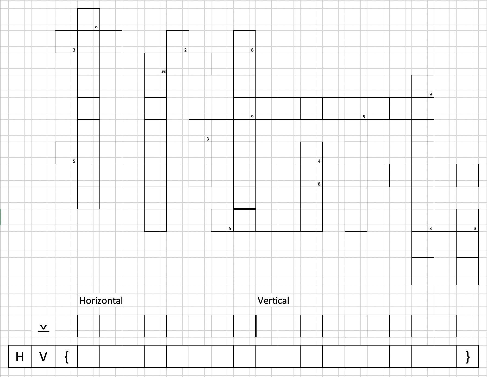
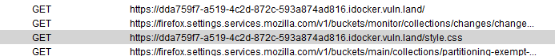
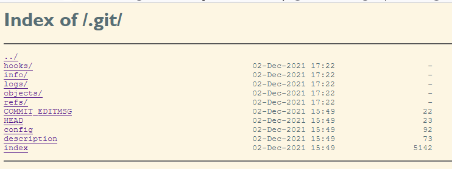
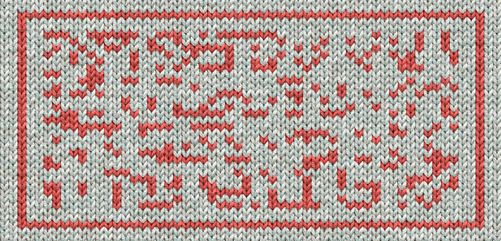

= Hackvent 2021 write-up
brp64
V1.0, 2021-12-31
:source-highlighter: pygments
:doctype: book
:stem:
:toc:
:toclevels: 1

== [HV21.01] X-wORd Puzzle

[cols="a,a", grid=none, frame = none]
|===

| [%autowidth, cols="1,1", grid=none, frame=ends]
!===
! Categories 
!  

! Level     
! Novice 
!===

| image::images/201.png[,350, align="right"]
|===

=== Intro

It seems the elves have sent us a message via a newspaper crossword puzzle. Can you solve it to find out what they want to tell us?

=== Instructions

-   Fill in the puzzle in all capital letters
-   The initial letters of each word are the solution - in order the same order
    the questions are asked:

    -   horizontal words: top to bottom
    -   vertical words: left to right

==== Horizontal

.   A diagram of arrows not allowing cycles (DAG)
.   A handbag for carrying around money (PURSE)
.   Very, very secure (ULTRASAFE)
.   Golf: number of strokes required (PAR)
.   Congo between 1971 and 1997 (ZAIRE)
.   State of appearing everywhere (UBIQUITY)
.   Tuples in everyday language (PAIRS)
.   Makes you laugh or silences you (GAG)

==== Vertical

.   Plea by many doctors right now (VACCINATE)
.   Put in parcels (PACKETED)
.   Lets you change user (SU)
.   \...-test (PEN)
.   How you should transmit your data (SECURELY)
.   Need to squash them - fix your code! (BUGS)
.   Attributed to a marquis - no pain, no gain. (SADIST)
.   Doing something in a way that causes fatigue is doing it\... (WEARINGLY)
.   A drink you may need after finishing this puzzle. (GIN)

=== Hints
****
-   the words are in order (ltr & ttb): first hint is for the top left
    horizontal word
-   number means number of chars in word
-   check the title - do you need all the letters?
-   we know how to hide gridlines
-   what seems redundant really isn't - it's the key you seek

****

=== Solution

The solutions to the clues are added already in CAPITALS above. This gives the
first step of the solution as `DPUPZUPGVPSPSBSWG`. Hoever, as indicated by the
title of the challenge, we have to do some XORing to get the real solution.
After some trial-and-error, we find that the number of characters of the
solution can be XORed with the first letter to get the solution:

`DPUPZUPGVPSPSBSWG` XOR `35935853982384693` gives `welcometohackvent`.

So the flag is `HVwelcometohackvent`.

== [HV21.02] No source, No luck!

[cols="a,a", grid=none, frame = none]
|===

| [%autowidth, cols="1,1", grid=none, frame=ends]
!===
! Categories 
!  

!  Level     
!   easy
!===

| image::images/202.png[,350]
|===

****
Thanks!

This challenge is brought to you by *explo1t*. There were no elves harmed
during its creation.
****

=== Introduction

Now they're just trolling you, aren't they? They said there would be a flag,
but now they're not even talking to us for real, just shoving us along 😤 No
manners, they got!

=== Solution 
Just starting the container and opening it gets us rickrolled: first a gif of
Rick Astley, then a redirect to Youtube. Using ZAP, we see that only two calls
to the container are made: first the main page and then to fetch the CSS.

 
// {width="150mm"}

The main page is empty, but the CSS contains the flag:

[source,css]
----
body::after {
  margin-left: 16px;
  display: inline;
  content: "HV21{h1dd3n_1n_css}";
  background: #ff4473;
  animation: blink 1s infinite;
}
----

So the flag is `HV21{h1dd3n_1n_css}`.

== [HV21.03] Too Much GlItTer!

[cols="a,a", grid=none, frame = none]
|===

| [%autowidth, cols="1,1", grid=none, frame=ends]
!===
! Categories 
! 

! Level        
! easy
!===

| image::images/207.png[,350]
|===

Well, well, well, what's that I see there?

****
Thanks!

This challenge is brought to you by *HaCk0*. The reindeer helped!
****

=== Introduction

To celebrate Christmas even more the elves have setup a small website to help
promote christmas on the internet. It is currently under heavy development but
they wanted to show it off anyhow.

Unfortunately they made a pretty silly error which threatens the future of
their project.

=== Goal

Can you help them find the vulnerability and retrieve the flag?

=== Solution

The hint points towards an issue with the elves using `git`, but on first sight
nothing on the page seems to indicate anything. But calling up the `.git`
directory in the URL shows a listing of the `.git` directory!

We can read the whole repo, we just have to find a way to mirror all the data
to get a local repo. Luckily, someone has described this already in detail at
https://en.internetwache.org/dont-publicly-expose-git-or-how-we-downloaded-your-websites-sourcecode-an-analysis-of-alexas-1m-28-07-2015/[https://en.internetwache.org]
and we can just follow this recipe. We get a clone of the bare repo with two
branches: *master* and *feature/flag*. So switch to the *feature/flag* branch
to get a file `flag.html` that contains the data:

[source,html]
----
 html
    <article class="col1">
      

        <h3><strong>&nbsp;</strong>Flag</h3>
        
          Here is the flag: HV{n3V3r_Sh0w_Y0uR_.git}
          
    

----

So the flag is `HV{n3V3r_Sh0w_Y0uR_.git}`.

== [HV21.04] Christmas in Babylon

[cols="a,a", grid=none, frame = none]
|===

| [%autowidth, cols="1,1", grid=none, frame=ends]
!===
! Categories 
!  

! Level   
! easy
!===

| image::images/209.png[,350,align="right"]
|===

We need a Babelfish!

****
Thanks!

This challenge is brought to you by *2d3*. They understand all the elves!
****

=== Introduction

Something weird happened to the elves, suddenly when one says something,
there's a number of the others required to translate what they mean. It only
becomes clear in the end.

=== Goal

Can you help Santa understand what they're saying?

A file is provided `code.zip`.

== Solution

The zip file contians a single file, `code.txt`, that contains something like
C# code. Rather than looking for a compiler, I quickly rewrote the code in
python:

[source,python]
----
import base64

def Rev(s):
    print(base64.b64decode(s)[::-1])

Rev("KzgrKitoKysrKysreysrKysraSsvPiswK3krKz4oKysrKysrICsrPlQrKysrKysrKyt9KysrPlsrVCsrK3grKysr")
----

Running this code prints another program, this time written in brainfuck and ran the code in an on-line simulator at <https://www.bf.doleczek.pl/>. Another program is printed, this time a bourne shell script. Running it creates another program, but this time a mixed C/python program:

[source,python]
----
#include <stdio.h>
#define data const char p[17]
#define u(x) x % 128 + 32
#define bytearray(x) {u(547),u(139),u(432),u(345),u(596),u(840),u(847),u(718),u(669),u(547),u(345),u(596),u(840),u(847),u(718),u(31),0}
#define b64decode
#define discard int _
#define from int main(void) {
#define base64
#define import
#define hashlib
#define sys
from base64 import b64decode
import hashlib
import sys
data = bytearray(b64decode("Z1hwRFQN...wGSQQ="));
discard = 1 // 3; """
    ;
    printf("%s", p);
    return 0;
}
/* """
pwd = input().encode("utf-8")
if hashlib.sha256(pwd).hexdigest() != \
      "2cbdd00836863dbf7a24c10c67c3d9b7da272a6e2d0532689aebd2598fb7d53a" :
    sys.exit(1)

for i in range(len(data)) :
    data[i] ^= pwd[i % len(pwd)]

print(bytes(data).decode("utf-8"))
# */
----

Running the program with python asks for a password, the password is the output
of running the C-program! Cool!

    $  gcc code3 && ./a.exe
    C+Python=Cython?
    $ python code3 >code4
    C+Python=Cython?

Now we arrive at a PHP program, again an on-line resource can be used to run
the program
(https://www.w3schools.com/php/phptryit.asp?filename=tryphp_compiler).
Another program is printed, this time a JSFuck program (see
http://www.jsfuck.com/). This program can be run using `node` and produces
the flag `HV21{-T00-many-weird-L4NGU4GE5-}'`.

== [HV21.05] X-Mas Jumper {#hv21.05}

[cols="a,a", grid=none, frame = none]
|===

| [%autowidth, cols="1,1", grid=none, frame=ends]
!===
! Categories 
!  

! Level        
! easy
!===

| 
|===

Wear it with pride!

****
Thanks!

This challenge is brought to you by *monkey*. Tight knitting!
****

=== Introduction

The elves have been getting into the festive spirit by making Christmas jumpers
for themselves to wear in the workshop. They made one for Santa too, but it
looks like they didn't program the knitting machine correctly.

=== Goal

Can you untangle this mess and find the pattern they were trying to make?

== Solution

This was an easy challenge, but it took a lot of effort. Since it is labelled
as easy, I assumed right away, that it is not encrypted, but just somehow the
line-lenght might not be correct. Most of the time was spent trying to avoid
having to read off the pattern. When it was clear that the crafts-skills did
not do the job, it was the hard way. After trying all the possible divisors of
the pattern (48*27 dots), I noticed that for a line length of 36 the pattern
looked quite interesting:

[source,python]
----
for i in range(5):
        stepi = 3**i
        for j in range(5):
                stepj = 2 ** j
                step = stepi * stepj
                print(step, stepi, stepj)
                count = 0
                for i in range(0,len(msg), step):
                        print(prn(msg[i:i+step]))
                        if count>10:
                                break
                        count += 1
                print('-'*80)
----
    XXX  XXXXXX  XXX  X XXXXXXX
      X    X  X    X  X  X  X  X
       X    X  X    X  X  X  X  X  XX
    XX  XXXXXX  X    X X      X    X  X
    X  X X    X   X  X   X     X    X  X
     X  X X    X   X  X   X     X    X
    X X  X X    X    XX    X     X    X
     X X  XXXX  XXX   X      X   XXX
    XX   XX
                    XXX  XX  XXX
       XXX            X   X  X   X
         X             X  X      X  XX X

There are many lines at a 45° angle, so it seems that the stride is just off by
one. So try it with a stride of 37 and get a nice result:

----
    XXX  XXXXXX  XXX  X XXXXXXX                 XXX  XX  XXX           XXX
     X    X  X    X  X  X  X  X                  X   X  X   X           X 
     X    X  X    X  X  X  X  X  XX   XX         X  X      X  XX XXX XX X 
     XXXXXX  X    X X      X    X  X X  X        XXX     XX    X  X  X  X 
     X    X   X  X   X     X    X  X X  X        X  X      X   X  X  X  X 
     X    X   X  X   X     X    X  X X  X        X  X       X  X  X  X  X 
     X    X    XX    X     X    X  X X  X        X  X   X   X   XX XX   X 
    XXX  XXX   X      X   XXX    XX   XX XXXXX  XXX  XX  XXX     X X   XXX

            XXXXXXX  XXXX  XXXXX         XX    XX        XXX            X  X
             X    X X    X  X   X         X    X          X            XXX  X
             XXXX   X   XX  X    X        X    X  X   X   X       XXX  XXX  X
             X  X   X  X X  X    X         X   X XX  XX   X      X   X XXX   X
             X      X X  X  X   X           XXXX  X   X   X      XXXXX  X   X
             X      XX   X  XXXX               X  X   X   X      X      X   X
   X         X      X    X  X   X             X   X   X   X    X X   X      X
XXX XXXXXX  XXX      XXXX  XX   X  XXXXXX XXXX     XXX X XXXXXX   XXX   X  X
----

And the flag is `HV{T00_K3wL_F0R_YuLe!}`

![[day05]]
![[day06]]
![[day07]]
![[day08]]
![[day09]]
![[day10]]
![[day11]]
![[day12]]
![[day13]]
![[day15]]
![[day17]]
![[day18]]
![[day20]]
![[day21]]
![[day22]]
![[day23]]
![[hidden01]]
![[hidden02]]
