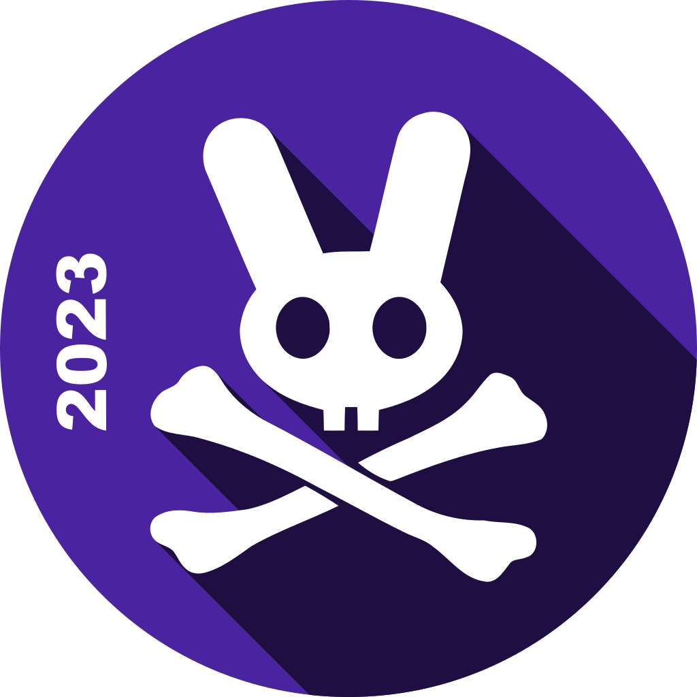
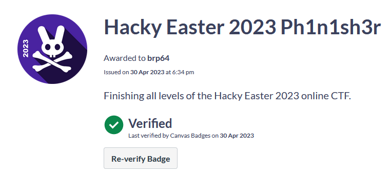

= Hacky Easter 2023 write-up
brp64
V1.0, 2022-05-15
:source-highlighter: pygments
:doctype: book
:stem:
:toc:

== Teaser

include::00teaser/teaser.adoc[leveloffset=2]
== Level 1: Welcome

Welcome to Hacky Easter 2023! 👋

Let's start with a little sanity check.

include::level1/level1.adoc[leveloffset=2]

== Level 2: N00b Zone

Four more n00b challenges 👶

Solve two and you'll get to level three.

include::level2/level2.adoc[leveloffset=2]

== Level 3: It's so Easy
These are a bit harder, but they are still so easy 🍰!

Again, two out of four is enough. It will become harder, I promise!

include::level3/level3.adoc[leveloffset=2]

== Level 4
Level 4: Quattuor

Level 4️⃣ - first medium challenges here.

You'll need to solve one of those, the easy ones are not enough!

include::level4/level4.adoc[leveloffset=2]

== Level 5: Gimme Five!

✋ Well done, first four levels done! Four more to come.

include::level5/level5.adoc[leveloffset=2]

== Level 6: The Sixth Sense

Check out the first hard challenge here.

No worries, you won't need to solve it. Solving all medium ones is also
sufficient 😅.

include::level6/level6.adoc[leveloffset=2]

== Level 7: Quite Hard

You made it here, not bad! ✨

Now you'll need to solve hard challenges in order to level up. Are you skilled
enough for that?

include::level7/level7.adoc[leveloffset=2]

== Level 8: Endgame
This is the last level 😱.

Solve three out of four to join the Ph1n1sh3r's club and get a badge!

include::level8/level8.adoc[leveloffset=2]

== Level 9: The End

=== PH1N1SH3R 2023

You have mastered all levels in Hacky Easter 2023! Congrats!! 🎉🎉🎉🤙

You should get a 🏅 badge from eu.badgr.com soon. If not, please contact us at hackyeaster@gmail.com.

Got feedback? Let us know! Feedback Form

